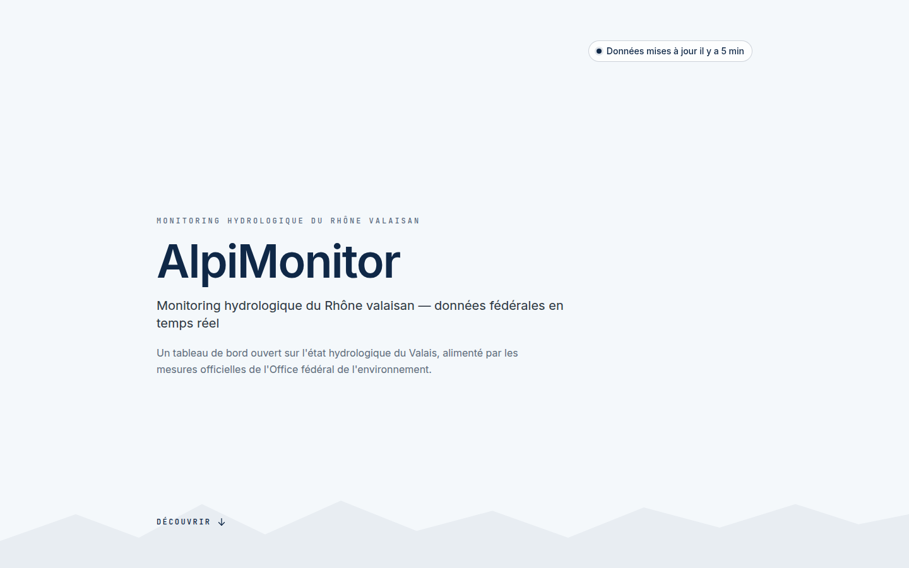
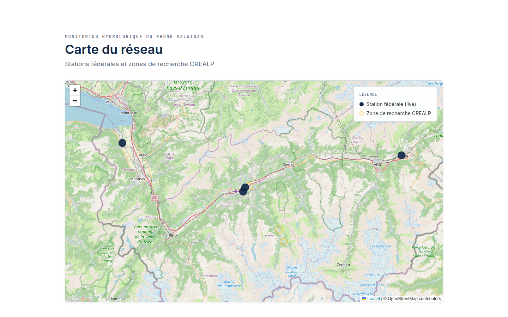

# AlpiMonitor

[](https://github.com/sodigitaljeremy/alpimonitor/actions/workflows/ci.yml)

Tableau de bord hydrologique du bassin de la Borgne (Valais, Suisse) — projet de démonstration technique pour une candidature Front-End au [CREALP](https://www.crealp.ch).

Consomme les données ouvertes de l'Office fédéral de l'environnement (OFEV/BAFU) via LINDAS SPARQL (cf. [ADR-007](./docs/09-architectural-decisions/adr-007.md)) et les met en scène pour une lecture rapide par les acteurs du territoire alpin.

## 🌐 Démo live

- Application : <https://alpimonitor.fr>
- API : <https://api.alpimonitor.fr/api/v1/health>
- Observabilité : <https://api.alpimonitor.fr/api/v1/status>
- Design system : <https://storybook.alpimonitor.fr> — 46 stories + 5 MDX (Atomic Design catalogue, cf. [ADR-009](./docs/09-architectural-decisions/adr-009.md))
- Documentation : <https://docs.alpimonitor.fr> — architecture arc42 en 10 sections (contexte, building blocks, runtime, deployment, 11 ADR, glossaire), cf. [ADR-011](./docs/09-architectural-decisions/adr-011.md)

L'application est déployée en continu via Coolify sur push `main`. Les données affichées sont temps réel — le cron LINDAS agrège les débits du Rhône valaisan toutes les 10 minutes.

## 📸 Aperçu

### Vue d'ensemble (Hero)



### Carte interactive des stations



_Captures générées automatiquement via [`scripts/screenshots.mjs`](./scripts/screenshots.mjs) — relançables avec `node scripts/screenshots.mjs`._

## 📊 Faits marquants

- 13 jours de développement pour une candidature CREALP (deadline 30 avril 2026)
- 173 tests automatisés verts en CI (71 backend + 102 frontend)
- 11 ADR documentées dont 2 avec drifts d'implémentation assumés
- Pivot technique majeur en cours de projet : XML OFEV → LINDAS SPARQL ([ADR-007](./docs/09-architectural-decisions/adr-007.md))
- Production stable depuis 2026-04-20, ingestion 24/7 sans incident
- Architecture claire : monorepo pnpm, Atomic Design ABEM, hexagonal API, Docker multi-stage

## 🛠 Stack

- **Frontend** : Vue 3 + Vite + TypeScript strict + Tailwind v3.4 (convention ABEM) · Pinia · vue-i18n · Leaflet (tuiles OSM) · D3 (charts vanilla)
- **Backend** : Fastify 5 + Prisma 5 + PostgreSQL 16 · Zod (validation) · Pino (logs structurés) · cron interne (ingestion LINDAS)
- **Infra** : Docker multi-stage · pnpm workspaces · Coolify v4 sur Hetzner · Traefik + Let's Encrypt · GitHub Actions (lint + typecheck + tests + build)

## Quickstart (dev)

Prérequis : Docker + Docker Compose v2.

```bash
git clone git@github.com:sodigitaljeremy/alpimonitor.git && cd alpimonitor
cp .env.example .env
cp apps/web/.env.example apps/web/.env
docker compose up
```

Variables clés :

- `.env` (racine) — DB + API (`DATABASE_URL`, `CORS_ORIGINS`, `SEED_ON_BOOT`)
- `apps/web/.env` — front (`VITE_API_BASE_URL`), inliné dans le bundle au build

Services :

- Web (Vite dev server) — <http://localhost:5173>
- API (Fastify) — <http://localhost:3000/api/v1/health>
- PostgreSQL — `localhost:5432` (user/pass/db dans `.env`)

Les sources `apps/*/src` et `packages/shared/src` sont bind-mountées — le hot-reload fonctionne sans rebuild.

### Seed de démo

Données de contexte (bassin Borgne, 3 stations, capteurs, seuils, glaciers Ferpècle/Mont Miné, captages Grande Dixence) — idempotent, ré-exécutable à volonté :

```bash
pnpm --filter @alpimonitor/api exec prisma db seed
```

Les mesures hydrologiques arrivent via le cron LINDAS (toutes les 10 min).

## Déploiement (production)

Cible : Coolify v4 sur VPS Hetzner, Postgres containerisé, Traefik géré par Coolify pour le routage et TLS Let's Encrypt.

Fichiers concernés :

- `apps/api/Dockerfile` — image runtime multi-stage (tini PID 1, user non-root, `prisma migrate deploy` au démarrage)
- `apps/web/Dockerfile` + `apps/web/nginx.conf` — build Vite puis service statique via nginx alpine (SPA fallback, cache assets, gzip)
- `docker-compose.prod.yml` — une seule ressource Coolify regroupant `postgres` + `api` + `web`
- `.env.production.example` — variables à renseigner dans le panneau Coolify (`DATABASE_URL`, `CORS_ORIGINS`, `VITE_API_BASE_URL`, secrets Postgres)

Smoke test en local (images prod sans bind-mount) :

```bash
cp .env.production.example .env.production
docker compose -f docker-compose.prod.yml --env-file .env.production up --build
```

Les domaines `alpimonitor.fr`, `www.alpimonitor.fr` et `api.alpimonitor.fr` sont mappés dans l'UI Coolify vers les services `web` (port 80) et `api` (port 3000).

## 🧠 Choix techniques notables

Quelques décisions assumées et documentées :

- **LINDAS SPARQL plutôt que XML OFEV** ([ADR-007](./docs/09-architectural-decisions/adr-007.md)) — le flux XML `hydroweb.xml` renvoie 404 depuis la migration BAFU vers la plateforme LINDAS. Pivot en cours de projet.
- **Single-page scrollable plutôt que multi-pages** ([§3.3 périmètre](./docs/03-context-and-scope/index.md)) — densité d'impression recruteur en moins de 30 secondes.
- **Tuiles OSM plutôt que swisstopo WMTS** ([ADR-005 drift](./docs/09-architectural-decisions/adr-005.md)) — stabilité et zero-cost attribution pour la démo.
- **Atomic Design ABEM strict** ([ADR-002](./docs/09-architectural-decisions/adr-002.md)) — préfixes `a-` / `m-` / `o-` / `t-` / `p-` sur 100% des composants Vue.
- **Transparence du sourcing des stations research** ([ADR-008](./docs/09-architectural-decisions/adr-008.md)) — champ `sourcingStatus` orthogonal à `dataSource` distingue `CONFIRMED` (crealp.ch documenté) de `ILLUSTRATIVE` (placement plausible démo).
- **Storybook exhaustif, exclusions assumées** ([ADR-009](./docs/09-architectural-decisions/adr-009.md)) — 15 composants présentationnels storyisés ; 3 organisms Pinia + Leaflet + router volontairement exclus pour éviter de mocker l'infra.
- **Façades feature-grouped + `lib/` domain-scoped** ([ADR-010](./docs/09-architectural-decisions/adr-010.md)) — pattern post-refactor : `composables/stations/` expose 3 façades read-only, aucun consumer prod n'importe `useStationsStore` directement (règle vérifiée par grep).
- **Lecture seule, pas d'auth** — l'épopée admin (alertes, seuils, JWT) est volontairement hors scope candidature.

## 📚 Documentation

Navigation complète sur **[docs.alpimonitor.fr](https://docs.alpimonitor.fr)** — site arc42 en 10 sections :

- [§1 Introduction et objectifs](./docs/01-introduction-and-goals/index.md) + [§2 Contraintes et qualité](./docs/02-constraints-and-quality/index.md) — pitch + critères vérifiables + parties prenantes
- [§3 Contexte et périmètre](./docs/03-context-and-scope/index.md) + [sources de données](./docs/03-context-and-scope/data-sources.md) — C4 Context + LINDAS + sourcing stations
- [§4 Stratégie de solution](./docs/04-solution-strategy/index.md) + [§5 Building blocks](./docs/05-building-block-view/index.md) — stack top-level + C4 Containers + composants frontend/backend/persistence
- [§6 Runtime view](./docs/06-runtime-view/index.md) + [§7 Deployment view](./docs/07-deployment-view/index.md) — 3 scénarios sequence + Coolify topology + 3 post-mortems incidents
- [§8 Cross-cutting concepts](./docs/08-cross-cutting-concepts/index.md) — design system, conventions, observabilité, sécurité
- [§9 Décisions architecturales](./docs/09-architectural-decisions/index.md) — 11 ADR (format Date/Statut/Contexte/Décision/Conséquences/Alternatives)
- [§10 Risques et dette](./docs/10-risks-and-debt/index.md) + [glossaire 36 termes](./docs/10-risks-and-debt/glossary.md) — non-scope candidature + dette assumée + audit refactor

Le contenu pré-arc42 (context métier, PRD, runbooks, design-system legacy) reste accessible sous [`docs/_legacy/`](./docs/_legacy/) pour archéologie git — migré verbatim vers les sections arc42 ci-dessus, conservé pour traçabilité.

Le point d'entrée pour toute session Claude Code est [`CLAUDE.md`](./CLAUDE.md).

## Versioning

Les tags git marquent les phases livrées, à lire dans l'ordre :

- [`v1.0.0-crealp`](https://github.com/sodigitaljeremy/alpimonitor/releases/tag/v1.0.0-crealp) — Livrable candidature initial : landing live, ingestion LINDAS temps réel, 7 stations cartographiées, Lighthouse Desktop 96/100/100/100.
- [`v1.1.0-refactor`](https://github.com/sodigitaljeremy/alpimonitor/releases/tag/v1.1.0-refactor) — Design system + architecture : Storybook exhaustif (46 stories, cf. [ADR-009](./docs/09-architectural-decisions/adr-009.md)) et refactor architecture (façades feature-grouped, `lib/` domain-scoped, règle « aucun consumer prod hors façades » enforced, cf. [ADR-010](./docs/09-architectural-decisions/adr-010.md)).

## Licence et attributions

Données hydrologiques : [OFEV/BAFU via LINDAS](https://lindas.admin.ch) · Fond cartographique : © [OpenStreetMap contributors](https://www.openstreetmap.org/copyright).
