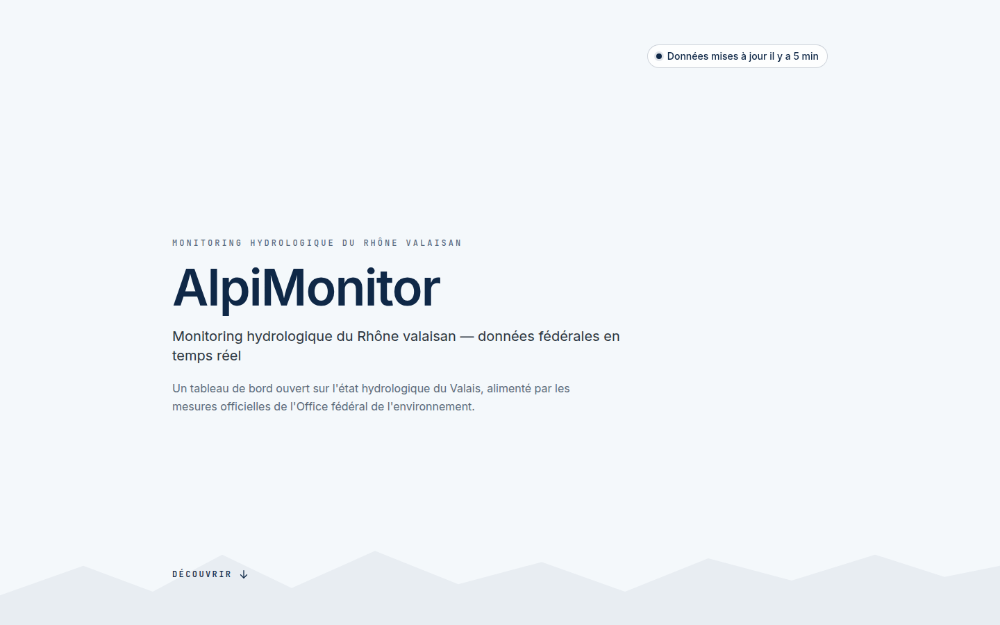
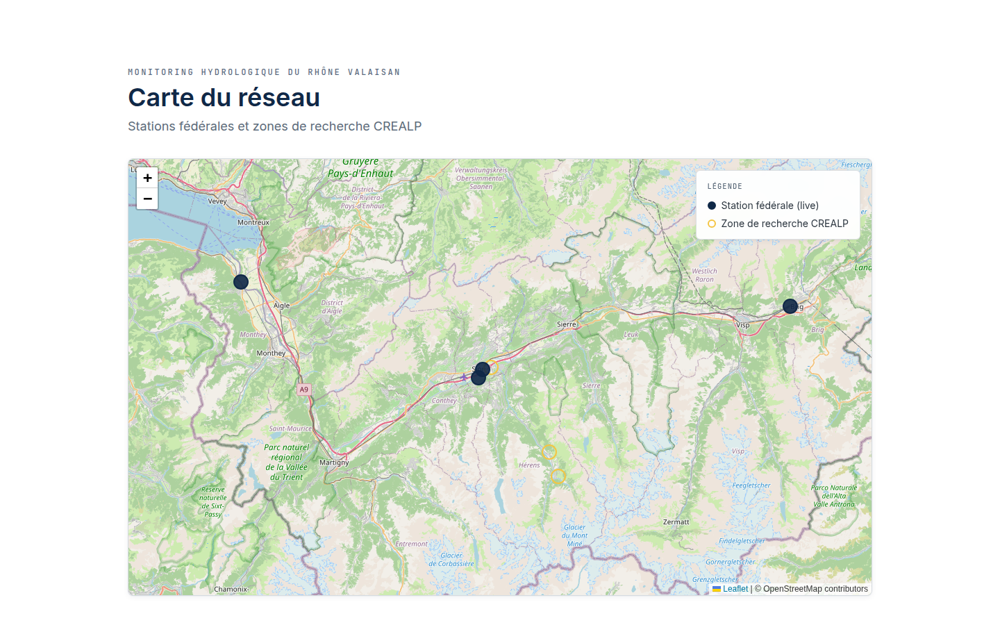

# AlpiMonitor

[](https://github.com/sodigitaljeremy/alpimonitor/actions/workflows/ci.yml)

Tableau de bord hydrologique du bassin de la Borgne (Valais, Suisse) — projet de démonstration technique pour une candidature Front-End au [CREALP](https://www.crealp.ch).

Consomme les données ouvertes de l'Office fédéral de l'environnement (OFEV/BAFU) via LINDAS SPARQL (cf. [ADR-007](./docs/09-architectural-decisions/adr-007.md)) et les met en scène pour une lecture rapide par les acteurs du territoire alpin.

## 🌐 Démo live

- Application : <https://alpimonitor.fr>
- API : <https://api.alpimonitor.fr/api/v1/health>
- Observabilité : <https://api.alpimonitor.fr/api/v1/status>
- Design system : <https://storybook.alpimonitor.fr> — 46 stories + 5 MDX (Atomic Design catalogue, cf. [ADR-009](./docs/09-architectural-decisions/adr-009.md))
- Documentation : <https://docs.alpimonitor.fr> — architecture arc42 en 10 sections (contexte, building blocks, runtime, deployment, 11 ADR, glossaire), cf. [ADR-011](./docs/09-architectural-decisions/adr-011.md)

L'application est déployée en continu via Coolify sur push `main`. Les données affichées sont temps réel — le cron LINDAS agrège les débits du Rhône valaisan toutes les 10 minutes.

## 📸 Aperçu

### Vue d'ensemble (Hero)



### Carte interactive des stations



_Captures générées automatiquement via [`scripts/screenshots.mjs`](./scripts/screenshots.mjs) — relançables avec `node scripts/screenshots.mjs`._

## 📊 Faits marquants

- 13 jours de développement pour le livrable de candidature CREALP (deadline 30 avril 2026), prolongé par une **couche IA additive** post-candidature (cf. [🤖 Couche IA](#-couche-ia-extension-post-candidature))
- 344 tests automatisés verts en CI (208 backend + 136 frontend)
- 12 ADR documentées dont 2 avec drifts d'implémentation assumés
- Pivot technique majeur en cours de projet : XML OFEV → LINDAS SPARQL ([ADR-007](./docs/09-architectural-decisions/adr-007.md))
- Production stable depuis 2026-04-20, ingestion 24/7 sans incident
- Architecture claire : monorepo pnpm, Atomic Design ABEM, backend monolithe en couches fines et pragmatique (YAGNI) — avec une **frontière hexagonale (ports/adapters) localisée à la seule couche chat IA** ([ADR-012](./docs/09-architectural-decisions/adr-012.md)), Docker multi-stage

## 🛠 Stack

- **Frontend** : Vue 3 + Vite + TypeScript strict + Tailwind v3.4 (convention ABEM) · Pinia · vue-i18n · Leaflet (tuiles OSM) · D3 (charts vanilla)
- **Backend** : Fastify 5 + Prisma 6 + PostgreSQL 16 · Zod (validation) · logs structurés (logger Fastify/pino) · cron interne (ingestion LINDAS)
- **Couche IA** (additive, [ADR-012](./docs/09-architectural-decisions/adr-012.md)) : Mistral derrière une interface `LlmClient` isolée · function-calling sur 4 fonctions whitelistées (frontière hexagonale `QueryPort`/`PrismaQueryAdapter`) · observabilité LLM maison (`LlmCallRun`, coût/latence/tokens) · détection d'anomalie statistique (z-score déseasonnalisé, **pas de LLM**)
- **Infra** : Docker multi-stage · pnpm workspaces · Coolify v4 sur Hetzner · Traefik + Let's Encrypt · GitHub Actions (lint + typecheck + tests + build)

## Quickstart (dev)

Prérequis : Docker + Docker Compose v2.

```bash
git clone git@github.com:sodigitaljeremy/alpimonitor.git && cd alpimonitor
cp .env.example .env
cp apps/web/.env.example apps/web/.env
docker compose up
```

Variables clés :

- `.env` (racine) — DB + API (`DATABASE_URL`, `CORS_ORIGINS`, `SEED_ON_BOOT`)
- `apps/web/.env` — front (`VITE_API_BASE_URL`), inliné dans le bundle au build

Services :

- Web (Vite dev server) — <http://localhost:5173>
- API (Fastify) — <http://localhost:3000/api/v1/health>
- PostgreSQL — `localhost:5432` (user/pass/db dans `.env`)

Les sources `apps/*/src` et `packages/shared/src` sont bind-mountées — le hot-reload fonctionne sans rebuild.

### Seed de démo

Données de contexte (bassin Borgne, 3 stations, capteurs, seuils, glaciers Ferpècle/Mont Miné, captages Grande Dixence) — idempotent, ré-exécutable à volonté :

```bash
pnpm --filter @alpimonitor/api exec prisma db seed
```

Les mesures hydrologiques arrivent via le cron LINDAS (toutes les 10 min).

## Déploiement (production)

Cible : Coolify v4 sur VPS Hetzner, Postgres containerisé, Traefik géré par Coolify pour le routage et TLS Let's Encrypt.

Fichiers concernés :

- `apps/api/Dockerfile` — image runtime multi-stage (tini PID 1, user non-root, `prisma migrate deploy` au démarrage)
- `apps/web/Dockerfile` + `apps/web/nginx.conf` — build Vite puis service statique via nginx alpine (SPA fallback, cache assets, gzip)
- `docker-compose.prod.yml` — une seule ressource Coolify regroupant `postgres` + `api` + `web`
- `.env.production.example` — variables à renseigner dans le panneau Coolify (`DATABASE_URL`, `CORS_ORIGINS`, `VITE_API_BASE_URL`, secrets Postgres)

Smoke test en local (images prod sans bind-mount) :

```bash
cp .env.production.example .env.production
docker compose -f docker-compose.prod.yml --env-file .env.production up --build
```

Les domaines `alpimonitor.fr`, `www.alpimonitor.fr` et `api.alpimonitor.fr` sont mappés dans l'UI Coolify vers les services `web` (port 80) et `api` (port 3000).

## 🤖 Couche IA (extension post-candidature)

Une **couche d'intelligence additive et isolée** a été greffée après le livrable de candidature, sans jamais modifier le flux existant (LINDAS SPARQL → Prisma → API → SPA). Quatre briques, toutes en production, toutes documentées dans [ADR-012](./docs/09-architectural-decisions/adr-012.md) :

- **Narration LLM groundée** (A) — `GET /stations/:id/narrative` résume une série temporelle en langage naturel. Le LLM (Mistral, derrière une interface `LlmClient` isolée) ne reçoit que des **features pré-calculées** (delta, min/max, franchissement de seuil) : il *reformule* des faits, il n'invente ni n'extrapole (**grounding strict**). Résultat caché en base (`Insight`, idempotent) et étiqueté « résumé assisté par IA ».
- **Observabilité LLM maison** (D) — un décorateur `ObservingLlmClient` persiste un `LlmCallRun` par appel (coût estimé, latence, tokens), agrégé sur `GET /ai/status` et exposé par un badge global. Client **LiteLLM-ready** (OpenAI-compatible) mais proxy LiteLLM **non déployé** — point d'extension assumé.
- **Détection d'anomalie statistique** (B) — `GET /alerts` expose des épisodes d'anomalie détectés par un **z-score déseasonnalisé par heure-de-jour** (`apps/api/src/anomaly/`). C'est de la **statistique pure et déterministe, PAS de l'IA** : aucun appel LLM n'entre dans la décision. Limites (seuils non calibrés par une expertise hydrologique) revendiquées dans l'UI.
- **Chat sur données structurées** (C) — `POST /api/v1/ask` répond à des questions en langage naturel sur les données. Le LLM fait du **function-calling sur 4 fonctions whitelistées** (`find_stations`, `get_latest_measurements`, `get_measurement_stats`, `list_alerts`) — **pas de text-to-SQL, pas de vector store, pas d'embeddings**. Ces 4 fonctions *sont* le `QueryPort` (frontière hexagonale ports/adapters), implémenté par un `PrismaQueryAdapter` qui délègue aux services existants. Boucle d'outils **bornée à 2 rounds**, **grounding strict** (hors périmètre → « je ne peux pas répondre »), garde unifié maison (plafond coût $0,50/j + rate-limit par IP). Front : organisme `OChatPanel` en section dédiée scrollable + façade `useDataChat`.

> **Pourquoi c'est l'« hexagonal » réel du projet** : le README revendiquait initialement une architecture hexagonale absente du code (le backend est volontairement plat, YAGNI). Plutôt que de saupoudrer le buzzword, la frontière ports/adapters a été introduite **uniquement là où elle a une valeur technique** — la couche chat — où elle permet de tester le raisonnement sans DB (un `QueryPort` en mémoire). Le reste du backend reste plat et assumé.

## 🧠 Choix techniques notables

Quelques décisions assumées et documentées :

- **LINDAS SPARQL plutôt que XML OFEV** ([ADR-007](./docs/09-architectural-decisions/adr-007.md)) — le flux XML `hydroweb.xml` renvoie 404 depuis la migration BAFU vers la plateforme LINDAS. Pivot en cours de projet.
- **Single-page scrollable plutôt que multi-pages** ([§3.3 périmètre](./docs/03-context-and-scope/index.md)) — densité d'impression recruteur en moins de 30 secondes.
- **Tuiles OSM plutôt que swisstopo WMTS** ([ADR-005 drift](./docs/09-architectural-decisions/adr-005.md)) — stabilité et zero-cost attribution pour la démo.
- **Atomic Design ABEM strict** ([ADR-002](./docs/09-architectural-decisions/adr-002.md)) — préfixes `a-` / `m-` / `o-` / `t-` / `p-` sur 100% des composants Vue.
- **Transparence du sourcing des stations research** ([ADR-008](./docs/09-architectural-decisions/adr-008.md)) — champ `sourcingStatus` orthogonal à `dataSource` distingue `CONFIRMED` (crealp.ch documenté) de `ILLUSTRATIVE` (placement plausible démo).
- **Storybook exhaustif, exclusions assumées** ([ADR-009](./docs/09-architectural-decisions/adr-009.md)) — 15 composants présentationnels storyisés ; 3 organisms Pinia + Leaflet + router volontairement exclus pour éviter de mocker l'infra.
- **Façades feature-grouped + `lib/` domain-scoped** ([ADR-010](./docs/09-architectural-decisions/adr-010.md)) — pattern post-refactor : `composables/stations/` expose 3 façades read-only, aucun consumer prod n'importe `useStationsStore` directement (règle vérifiée par grep).
- **Lecture seule, pas d'auth** — l'épopée admin (alertes, seuils, JWT) est volontairement hors scope candidature.

## 📚 Documentation

Navigation complète sur **[docs.alpimonitor.fr](https://docs.alpimonitor.fr)** — site arc42 en 10 sections :

- [§1 Introduction et objectifs](./docs/01-introduction-and-goals/index.md) + [§2 Contraintes et qualité](./docs/02-constraints-and-quality/index.md) — pitch + critères vérifiables + parties prenantes
- [§3 Contexte et périmètre](./docs/03-context-and-scope/index.md) + [sources de données](./docs/03-context-and-scope/data-sources.md) — C4 Context + LINDAS + sourcing stations
- [§4 Stratégie de solution](./docs/04-solution-strategy/index.md) + [§5 Building blocks](./docs/05-building-block-view/index.md) — stack top-level + C4 Containers + composants frontend/backend/persistence
- [§6 Runtime view](./docs/06-runtime-view/index.md) + [§7 Deployment view](./docs/07-deployment-view/index.md) — 3 scénarios sequence + Coolify topology + 3 post-mortems incidents
- [§8 Cross-cutting concepts](./docs/08-cross-cutting-concepts/index.md) — design system, conventions, observabilité, sécurité
- [§9 Décisions architecturales](./docs/09-architectural-decisions/index.md) — 11 ADR (format Date/Statut/Contexte/Décision/Conséquences/Alternatives)
- [§10 Risques et dette](./docs/10-risks-and-debt/index.md) + [glossaire 36 termes](./docs/10-risks-and-debt/glossary.md) — non-scope candidature + dette assumée + audit refactor

Le contenu pré-arc42 (context métier, PRD, runbooks, design-system legacy) reste accessible sous [`docs/_legacy/`](./docs/_legacy/) pour archéologie git — migré verbatim vers les sections arc42 ci-dessus, conservé pour traçabilité.

Le point d'entrée pour toute session Claude Code est [`CLAUDE.md`](./CLAUDE.md).

## Versioning

Les tags git marquent les phases livrées, à lire dans l'ordre :

- [`v1.0.0-crealp`](https://github.com/sodigitaljeremy/alpimonitor/releases/tag/v1.0.0-crealp) — Livrable candidature initial : landing live, ingestion LINDAS temps réel, 7 stations cartographiées, Lighthouse Desktop 96/100/100/100.
- [`v1.1.0-refactor`](https://github.com/sodigitaljeremy/alpimonitor/releases/tag/v1.1.0-refactor) — Design system + architecture : Storybook exhaustif (46 stories, cf. [ADR-009](./docs/09-architectural-decisions/adr-009.md)) et refactor architecture (façades feature-grouped, `lib/` domain-scoped, règle « aucun consumer prod hors façades » enforced, cf. [ADR-010](./docs/09-architectural-decisions/adr-010.md)).
- `v1.2.0-ai` — Couche IA, extensions A + D : narration LLM groundée (Mistral derrière `LlmClient` isolée, cache `Insight`) + observabilité LLM maison (`LlmCallRun`, `GET /ai/status`, badge global), cf. [ADR-012](./docs/09-architectural-decisions/adr-012.md).
- `v1.3.0-anomaly` — Extension B : détection d'anomalie statistique (z-score déseasonnalisé par heure, `GET /alerts`, `OAlertsPanel`) — module séparé, **sans LLM**.
- `v1.4.0-chat-api` — Extension C (backend) : chat sur données structurées, frontière hexagonale `QueryPort`/`PrismaQueryAdapter`, function-calling sur 4 fonctions whitelistées, endpoint `POST /api/v1/ask` guardé et groundé.
- `v1.5.0-chat` / `v1.5.1-chat-ux` — Extension C (front) : organisme `OChatPanel` (section dédiée scrollable) + façade `useDataChat`, puis polish UX (questions d'exemple cliquables, prompt affiné, grounding intact).

## Licence et attributions

Données hydrologiques : [OFEV/BAFU via LINDAS](https://lindas.admin.ch) · Fond cartographique : © [OpenStreetMap contributors](https://www.openstreetmap.org/copyright).
