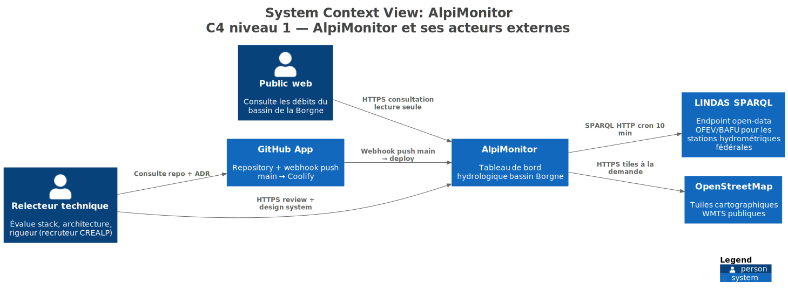
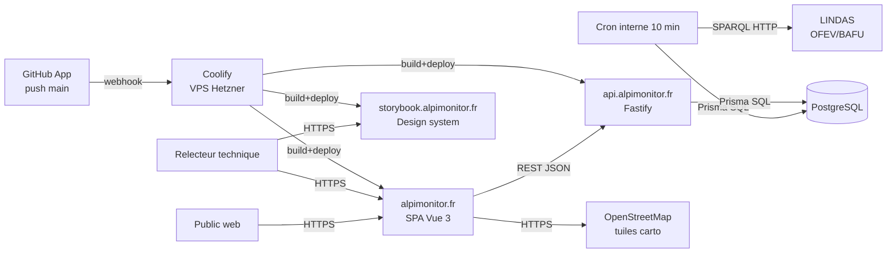

# §3 — Contexte et périmètre

## 3.1 Contexte système

AlpiMonitor est un système web autonome qui **consomme des données publiques ouvertes** et les **restitue en lecture seule** à un public web. Il n'est connecté à aucun CRM, aucun back-office tiers, aucune source privée.

Vue C4 niveau 1 (exportée depuis [Structurizr](../assets/structurizr/workspace.dsl)) :

La même topologie en Mermaid inline, orientée flux plutôt que C4 :

**Sens de lecture** : les flux descendants (utilisateur → système) sont synchrones au moment où l'utilisateur ouvre la page ; le flux LINDAS est asynchrone, déclenché par le cron interne toutes les 10 minutes ; le pipeline Coolify se déclenche à chaque push `main`.

## 3.2 Interfaces externes

| Interface | Protocole | Fréquence | Criticité | Détail |
|-----------|-----------|-----------|-----------|--------|
| **LINDAS SPARQL** (OFEV/BAFU) | SPARQL 1.1 sur HTTPS | Cron 10 min | Haute — alimente toute la donnée LIVE | Voir [Sources de données](data-sources.md). Pivot depuis XML OFEV en J4 ([ADR-007](../09-architectural-decisions/adr-007.md)). |
| **OpenStreetMap tuiles** | WMTS public (`tile.openstreetmap.org`) | À la demande navigateur | Moyenne — dégrade juste le fond carto | Drift assumé vs swisstopo WMTS ([ADR-005](../09-architectural-decisions/adr-005.md)) : stabilité + zero-cost attribution. |
| **Kroki.io** (build time uniquement) | HTTPS POST source PlantUML | À chaque `mkdocs build` | Basse — fallback local possible | Utilisé uniquement par la doc `docs.alpimonitor.fr`, jamais par l'app. Self-host `yuzutech/kroki` envisagé post-candidature. |
| **GitHub App `sodigitaljeremy`** | Webhook `push main` → Coolify | Par push | Moyenne — deploy manuel possible si down | Auto-deploy sur `main`. Pas de CI blocking pre-merge (CI actuellement informative). |
| **DNS OVH** (3 sous-domaines A + 1 AAAA) | Résolution DNS | Continue | Haute au bootstrap, faible une fois propagée | `alpimonitor.fr`, `api.alpimonitor.fr`, `storybook.alpimonitor.fr`, `docs.alpimonitor.fr`. |
| **Let's Encrypt** (via Traefik) | ACME HTTP-01 challenge | Renouvellement 60 j | Haute — expire si down | Géré automatiquement par Traefik dans Coolify. |

Les sources **non utilisées en v1** (MétéoSuisse SwissMetNet, GLAMOS temps réel, portail Web Hydro CREALP, Grande Dixence SA) sont tracées dans [ADR-007](../09-architectural-decisions/adr-007.md) §Alternatives écartées et [ADR-008](../09-architectural-decisions/adr-008.md) §Évolution future.

## 3.3 Périmètre (dans vs hors scope v1)

### Dans le scope v1 — démontrable à l'URL publique

- **Carte interactive Leaflet** centrée sur le Rhône valaisan, 7 stations géolocalisées avec distinction LIVE (rempli primary) vs RESEARCH (hollow alpine) ([ADR-005](../09-architectural-decisions/adr-005.md)).
- **Drawer fiche station** au clic sur un marker LIVE — métadonnées + chart D3 24 h + lien vers la page Hydrodaten BAFU si la station est confirmée ([§5 frontend](../05-building-block-view/frontend.md)).
- **Graphique D3 24 h** ([ADR-006](../09-architectural-decisions/adr-006.md)) avec tooltip hover, adaptatif largeur (mobile ↔ desktop).
- **Ingestion LINDAS automatique** toutes les 10 min ([ADR-007](../09-architectural-decisions/adr-007.md)) — upsert idempotent, archive JSON gzip, trace `IngestionRun`.
- **Observabilité publique** via `/api/v1/status` — `lastRun`, `lastSuccessAt`, `healthyThresholdMinutes`, compteurs journée. Badge live/stale/offline dans le hero.
- **Design system Storybook** — 15 composants présentationnels, 46 stories, 5 MDX ([ADR-009](../09-architectural-decisions/adr-009.md)).
- **Transparence sourcing** des stations RESEARCH via badge `ASourcingBadge` CONFIRMED/ILLUSTRATIVE ([ADR-008](../09-architectural-decisions/adr-008.md)).

### Hors scope v1 — explicitement écarté

Ces features font partie du PRD initial mais ont été intentionnellement exclues du livrable candidature. Leur absence est un parti-pris assumé, tracé dans le PRD et défendable en entretien :

| Hors scope | Motif | Où cela est tracé |
|-----------|-------|-------------------|
| **Multi-pages** (`/stations/:id`, `/compare`, `/alerts`) | Densité d'impression > dispersion multi-pages | [§1 objectifs](../01-introduction-and-goals/index.md) |
| **Admin UI + JWT + bcrypt** | Read-only public par design — aucune démonstration additionnelle pour le poste Front-End | [ADR-003](../09-architectural-decisions/adr-003.md) |
| **Alertes** (CRUD + détection moyenne mobile ±2σ) | Dépend de seuils + cron d'évaluation + UI — ROI signal faible vs coût | [§10 backlog](../10-risks-and-debt/index.md) |
| **Export CSV + brush/zoom D3** | Backlog v2. Le chart 24 h est assez court pour une lecture directe. | — |
| **E2E Playwright + Lighthouse formel** | Budget 13 j. Vitest + audit informel axe-core ont suffi. | — |
| **Python / FastAPI / ML / LLM embarqué** | Stack TypeScript unique ([ADR-001](../09-architectural-decisions/adr-001.md)) | [§2.1 contraintes](../02-constraints-and-quality/index.md) |
| **Vue Flow, module 3D, photogrammétrie** | Respect du territoire 3DGEOWEB. Hors périmètre candidature. | [§1.4 positionnement](../01-introduction-and-goals/index.md) |
| **Multi-langue, OAuth, multi-tenant, microservices** | Complexité sans gain signal pour le poste visé | [ADR-003](../09-architectural-decisions/adr-003.md) |
| **Helmet + rate-limit API** | Défauts Fastify acceptables pour démo read-only. À wirer en prod réelle. | [§10 dette assumée](../10-risks-and-debt/index.md) |

Un relecteur qui questionne "pourquoi X manque" doit pouvoir être renvoyé vers cette table + l'ADR ou la section PRD correspondante. Chaque exclusion est **nommée et justifiée**, pas oubliée.
