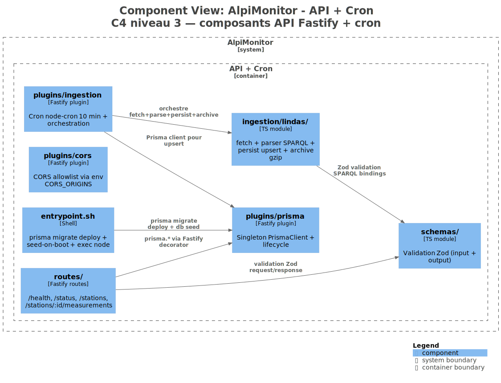

# Backend (Fastify + Prisma)

Décomposition C4-C3 du container API. Monolithe Fastify hébergeant à la fois les endpoints REST et le cron d'ingestion LINDAS ([ADR-003](../09-architectural-decisions/adr-003.md)).

Vue C4 niveau 3 backend (exportée depuis [Structurizr](../assets/structurizr/workspace.dsl)) :



## 5.B.1 Organisation du code

```text
apps/api/src/
├── routes/            # Définition Fastify (route + schema Zod + handler)
│   ├── health.ts      # GET /api/v1/health
│   ├── status.ts      # GET /api/v1/status
│   └── stations.ts    # GET /api/v1/stations + GET /api/v1/stations/:id/measurements
├── services/          # Orchestration métier (use cases)
├── domain/            # Entités métier pures (sans dépendance framework)
├── plugins/           # Plugins Fastify transverses
│   ├── cors.ts        # CORS allowlist via CORS_ORIGINS
│   ├── prisma.ts      # Singleton PrismaClient
│   ├── ingestion.ts   # Cron 10 min + orchestration ingestion
│   └── ...
├── ingestion/
│   └── lindas/        # Parser SPARQL + upsert idempotent + archive gzip
│       ├── fetch.ts
│       ├── parser.ts
│       ├── persist.ts
│       └── archive.ts
├── schemas/           # Zod (request/response) — certains ré-exportés depuis packages/shared
├── utils/
└── index.ts           # bootstrap Fastify + register plugins + listen
```

Les couches `domain/` + `services/` sont fines aujourd'hui — le code principal vit dans `routes/` (handlers) et `plugins/ingestion.ts`. Une séparation plus stricte se justifiera quand la surface métier grandira.

## 5.B.2 Endpoints REST

Tous versionnés sous `/api/v1`, base URL conventionnelle. Quatre endpoints en production :

- **`GET /api/v1/health`** — liveness probe minimaliste. Non authentifié. `{ status, timestamp, database }`. Retourne 503 si Postgres est inaccessible. Consommé par Coolify/Traefik pour déterminer si le container est prêt à recevoir du trafic.
- **`GET /api/v1/status`** — observabilité élargie. Non authentifié. Expose `ingestion.lastRun` (dernier `IngestionRun`), `ingestion.lastSuccessAt`, `ingestion.healthyThresholdMinutes`, `ingestion.today.{runsCount, measurementsCreatedSum, successRate}`. Consommé par le badge `MStatusBadge` dans `OHeroSection` (polling 60 s).
- **`GET /api/v1/stations`** — liste des stations actives avec leurs `latestMeasurements` par paramètre (`DISCHARGE`, `WATER_LEVEL`). Champs clés : `ofevCode`, `dataSource` (`LIVE` | `RESEARCH` | `SEED`), `sourcingStatus` (`CONFIRMED` | `ILLUSTRATIVE`). Query params : `catchmentId?`, `isActive?`.
- **`GET /api/v1/stations/:id/measurements`** — séries temporelles d'une station sur une fenêtre `[from, to]`. Query params obligatoires : `from`, `to` (ISO 8601). Optionnel : `parameter=DISCHARGE`. Retourne `{ data: { stationId, from, to, aggregate: 'raw', series: MeasurementSeries[] } }`.

Chaque endpoint est typé via un schéma Zod (`schemas/`) appliqué à la fois en validation request et en shape response. Les DTO sont définis dans `packages/shared/src/types/` — même source de vérité côté front et back.

Cinq épopées PRD sont explicitement hors scope v1 (admin thresholds, alerts CRUD, stations/:id détail complet, /auth/login, /compare) — tracées dans [§3.3 périmètre](../03-context-and-scope/index.md) et dans le PRD avec statut `CANCELLED`.

## 5.B.3 Plugin d'ingestion LINDAS

`apps/api/src/plugins/ingestion.ts` orchestre le cycle :

1. **Scheduling** — `node-cron` avec expression `INGESTION_SCHEDULE` (défaut `*/10 * * * *`). Démarrage au `onReady` hook Fastify, cleanup sur `onClose`.
2. **Fetch** — `undici` HTTP POST vers `https://lindas.admin.ch/query` avec la requête SPARQL cible (`apps/api/src/ingestion/lindas/fetch.ts`). Timeout 10 s, retry 3× backoff exponentiel.
3. **Parse** — validation Zod des bindings `SPARQL results JSON` avant persistance (`parser.ts`). Un binding malformé skip sans faire échouer le run entier.
4. **Persist** — upsert idempotent sur clé composite `{stationId, parameter, recordedAt}` via Prisma (`persist.ts`). Rejouer deux fois le même tick n'insère jamais de doublon.
5. **Archive** — `gzip` du payload SPARQL brut sur disque dans `/app/var/lindas-archive/YYYY-MM-DD/<timestamp>-<hash>.json.gz` (named volume Docker). Rotation 30 jours. Échec d'archive non-fatal (logué `warn`, cf. [post-mortem 2026-04-22 EACCES](../07-deployment-view/post-mortems/2026-04-22-eacces.md)).
6. **Trace** — chaque tick persiste un `IngestionRun` (`source: 'LINDAS_HYDRO'`, `status: SUCCESS | FAILURE | PARTIAL`, compteurs, durée, hash payload). Lu par `/status`.

**Environnement** contrôlable via :

- `INGESTION_ENABLED` (défaut `true` en prod, souvent `false` en tests pour désactiver le cron)
- `INGESTION_SCHEDULE` (cron expression)
- `INGESTION_HEALTHY_THRESHOLD_MINUTES` (défaut 30, piloté par `/status.ingestion.healthyThresholdMinutes`)

## 5.B.4 Plugins transverses

- **`plugins/cors.ts`** — CORS allowlist via `CORS_ORIGINS` (env, séparé par virgules). Aucune étoile en prod.
- **`plugins/prisma.ts`** — singleton `PrismaClient` attaché au lifecycle Fastify (`onClose` → `prisma.$disconnect()`).
- **Pino logger** — JSON stdout par défaut, niveaux structurés. Format `{ level, time, pid, hostname, msg, ... }`. Pas de PII. Agrégeable par n'importe quel stack (Loki, Datadog, CloudWatch) en v2.

**Pas wired en v1 — reportés post-candidature** :

- Helmet (headers sécurité côté API — les 6 headers nginx côté SPA couvrent l'essentiel ; l'API est read-only public).
- Rate limiting (`@fastify/rate-limit`) — démonstration publique, pas de protection DDoS nécessaire pour la démo.

## 5.B.5 Entrypoint et boot

`apps/api/entrypoint.sh` orchestre le démarrage du container API :

1. `prisma migrate deploy` — fatal en cas d'échec (`set -eu`). Démarrer contre un schéma stale est pire que ne pas démarrer.
2. `prisma db seed` — si `SEED_ON_BOOT=true`. Tolérant à l'échec (warn puis continue). Self-healing contre perte de données ([post-mortem 2026-04-21](../07-deployment-view/post-mortems/2026-04-21.md)).
3. `exec node dist/index.js` — `exec` pour que `tini` (PID 1) forwarde les signaux directement à Node.

Le seed n'insère que les tables de **contexte** (stations, glaciers, captages, seuils) via `upsert` idempotent. Les tables **opérationnelles** (`Measurement`, `IngestionRun`, `Alert`) sont exclusivement alimentées par le cron. Un re-seed ne détruit jamais l'historique ingéré.
