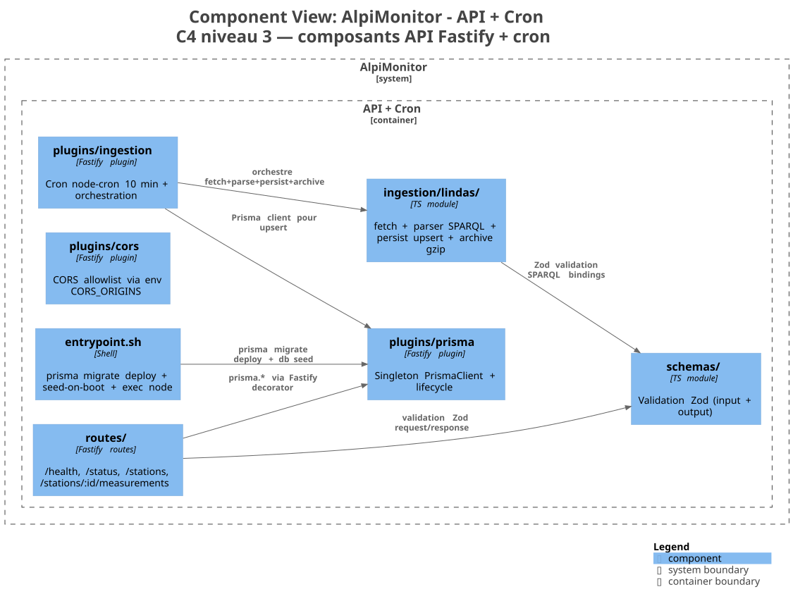

# Backend (Fastify + Prisma)

Décomposition C4-C3 du container API. Monolithe Fastify hébergeant à la fois les endpoints REST et le cron d'ingestion LINDAS ([ADR-003](../09-architectural-decisions/adr-003.md)).

Vue C4 niveau 3 backend (exportée depuis [Structurizr](../assets/structurizr/workspace.dsl)) :



## 5.B.1 Organisation du code

```text
apps/api/src/
├── routes/            # Définition Fastify (route + schema Zod + handler)
│   ├── health.ts      # GET /api/v1/health
│   ├── status.ts      # GET /api/v1/status
│   ├── ai.ts          # GET /api/v1/ai/status (couche IA D, ADR-012)
│   ├── alerts.ts      # GET /api/v1/alerts (couche IA B, ADR-012)
│   ├── ask.ts         # POST /api/v1/ask — chat sur données structurées (couche IA C, ADR-012)
│   └── stations.ts    # GET /stations, /stations/:id/measurements, /stations/:id/narrative
├── services/          # Orchestration métier (use cases)
│   ├── stations-service.ts
│   ├── alerts-service.ts     # réconciliation épisodique Alert + lecture /alerts (couche IA B, ADR-012)
│   └── narrative-service.ts  # mesures → features → narration (couche IA, ADR-012)
├── ai/                # Couche IA (ADR-012 — A narration, D observabilité, C chat)
│   ├── narration-features.ts # extraction de features pure et groundée (A2)
│   ├── llm-client.ts         # interface LlmClient isolée + impl Mistral (A3) + completeWithTools (C2)
│   ├── narration-prompt.ts   # prompt déterministe + PROMPT_VERSION (A3)
│   ├── narration-service.ts  # cache Insight idempotent + générateur (A3)
│   ├── observing-llm-client.ts # décorateur → 1 LlmCallRun/appel, coût/latence (D3)
│   ├── llm-pricing.ts        # computeCostUsd — tarifs publics, pur (D2)
│   └── chat/                 # Chat sur données structurées (extension C)
│       ├── query-port.ts          # QueryPort = les 4 fonctions whitelistées (frontière hexagonale, C1)
│       ├── prisma-query-adapter.ts # impl Prisma déléguant aux services existants (C1/D2)
│       ├── tools.ts               # specs des 4 tools + dispatcher vers le QueryPort (C3a)
│       ├── chat-prompt.ts         # prompt grounding-strict (C3a)
│       ├── chat-service.ts        # orchestrateur — boucle tool bornée 2 rounds (C3b)
│       └── rate-guard.ts          # garde unifié maison : cost-cap + rate-limit IP (C4)
├── anomaly/           # Détection d'anomalie STATISTIQUE (ADR-012, extension B — PAS de LLM)
│   ├── anomaly-detection.ts  # z-score déseasonnalisé par heure, pur + testable (B1/B1-bis)
│   └── anomaly-scan.ts        # scan isolé post-ingestion → réconcilie les épisodes (B2)
├── domain/            # Entités métier pures (sans dépendance framework)
├── plugins/           # Plugins Fastify transverses
│   ├── cors.ts        # CORS allowlist via CORS_ORIGINS
│   ├── prisma.ts      # Singleton PrismaClient
│   ├── llm.ts         # Singleton LlmClient (Mistral ; LiteLLM en D)
│   ├── ingestion.ts   # Cron 10 min + orchestration ingestion
│   └── ...
├── ingestion/
│   └── lindas/        # Parser SPARQL + upsert idempotent + archive gzip
│       ├── fetch.ts
│       ├── parser.ts
│       ├── persist.ts
│       └── archive.ts
├── schemas/           # Zod (request/response) — certains ré-exportés depuis packages/shared
├── utils/
└── index.ts           # bootstrap Fastify + register plugins + listen
```

Les couches `domain/` + `services/` sont fines aujourd'hui — le code principal vit dans `routes/` (handlers) et `plugins/ingestion.ts`. Une séparation plus stricte se justifiera quand la surface métier grandira.

## 5.B.2 Endpoints REST

Tous versionnés sous `/api/v1`, base URL conventionnelle. Huit endpoints :

- **`GET /api/v1/health`** — liveness probe minimaliste. Non authentifié. `{ status, timestamp, database }`. Retourne 503 si Postgres est inaccessible. Consommé par Coolify/Traefik pour déterminer si le container est prêt à recevoir du trafic.
- **`GET /api/v1/status`** — observabilité élargie. Non authentifié. Expose `ingestion.lastRun` (dernier `IngestionRun`, dont `measurementsCreatedCount` et `measurementsUnchangedCount` — cf. D0, compteurs honnêtes créés vs ré-vus), `ingestion.lastSuccessAt`, `ingestion.healthyThresholdMinutes`, `ingestion.today.{runsCount, measurementsCreatedSum, successRate}`. Consommé par le badge `MStatusBadge` dans `OHeroSection` (polling 60 s).
- **`GET /api/v1/ai/status`** — observabilité de la couche IA (ADR-012, D). Non authentifié. Agrège les `LlmCallRun` du jour : `ai.{callsToday, errorRate, costUsdToday, avgLatencyMs, lastCallAt}`. DB-down → 503. Consommé par un **second `MStatusBadge` global** dans `OHeroSection` (opérationnel/dégradé/indisponible).
- **`GET /api/v1/alerts`** — liste read-only des épisodes d'anomalie statistique (ADR-012, B). Non authentifié. Query params (Zod) : `status` (`open` | `closed` | `all`, défaut `open`), `stationId?`, `type?`, `limit?` (défaut 50, max 200). Retourne `{ data: AlertDTO[] }` trié `openedAt DESC` ; chaque `AlertDTO` porte `level`, `parameter`, `triggerValue`, `thresholdValue`, `openedAt`/`closedAt` et un sac `metadata` exposant les stats groundées (`mean`/`std`/`z`/`hourBucket`/`bucketSampleSize`/fenêtre). Consommé par `OAlertsPanel` (vue réseau) ; le compteur d'épisodes ouverts par station alimente aussi `activeAlertsCount` sur `/stations` (halo carte).
- **`GET /api/v1/stations`** — liste des stations actives avec leurs `latestMeasurements` par paramètre (`DISCHARGE`, `WATER_LEVEL`). Champs clés : `ofevCode`, `dataSource` (`LIVE` | `RESEARCH` | `SEED`), `sourcingStatus` (`CONFIRMED` | `ILLUSTRATIVE`). Query params : `catchmentId?`, `isActive?`.
- **`GET /api/v1/stations/:id/measurements`** — séries temporelles d'une station sur une fenêtre `[from, to]`. Query params obligatoires : `from`, `to` (ISO 8601). Optionnel : `parameter=DISCHARGE`. Retourne `{ data: { stationId, from, to, aggregate: 'raw', series: MeasurementSeries[] } }`.
- **`GET /api/v1/stations/:id/narrative`** — résumé LLM groundé d'un paramètre sur une fenêtre (couche IA, [ADR-012](../09-architectural-decisions/adr-012.md)). Query params : `parameter` (requis), `from`, `to` (ISO 8601), `lang?` (défaut `fr`). Validation Zod ; **404** station inconnue, **400** requête invalide. La couche IA ne renvoie jamais d'erreur HTTP : réponse **200** avec un état métier `state: generated | cached | unavailable` (+ `reason: insufficient_data | llm_error | config_error`), `text` (null si indisponible) et `grounding` (trend, deltaAbs, deltaPct, status, completeness) exposé pour transparence. DTO `StationNarrativeDTO` dans `packages/shared`.
- **`POST /api/v1/ask`** — chat sur données structurées par function-calling (couche IA C, [ADR-012](../09-architectural-decisions/adr-012.md)). Non authentifié, public. Body (Zod) : `{ question, language? }` (défaut `fr`). C'est la **surface la plus sensible** de la couche IA — les gardes C1→C4 y convergent, dans l'ordre : **(1)** rate-guard par IP + plafond coût (C4) court-circuite en **429** *avant* tout parsing ou appel LLM ; **(2)** validation Zod → **400** ; **(3)** chat groundé sur le `QueryPort` → **200** `{ answer, used: ToolUse[], language, generatedAt }` (`used` = trace honnête des tools appelés) ; **(4)** un `LlmError` dégrade gracieusement en **503** `AI_UNAVAILABLE`, jamais un 500 brut. DTO `AskResponseDTO` dans `packages/shared`. Détail du flux en [§5.B.8](#5b8-chat-sur-donnees-structurees-adr-012-extension-c) et [§6.4 runtime](../06-runtime-view/index.md#64-chat-sur-donnees-structurees-post-ask).

Chaque endpoint est typé via un schéma Zod (`schemas/`) appliqué à la fois en validation request et en shape response. Les DTO sont définis dans `packages/shared/src/types/` — même source de vérité côté front et back.

Épopées PRD hors scope v1 (admin thresholds, alerts **CRUD/notifications**, stations/:id détail complet, /auth/login, /compare) — tracées dans [§3.3 périmètre](../03-context-and-scope/index.md) et dans le PRD. La **lecture** d'anomalies (`GET /alerts`, détection statistique) est en revanche livrée via la couche IA additive (ADR-012, B) ; seules l'écriture/admin et les notifications restent exclues.

## 5.B.3 Plugin d'ingestion LINDAS

`apps/api/src/plugins/ingestion.ts` orchestre le cycle :

1. **Scheduling** — `node-cron` avec expression `INGESTION_SCHEDULE` (défaut `*/10 * * * *`). Démarrage au `onReady` hook Fastify, cleanup sur `onClose`.
2. **Fetch** — `undici` HTTP POST vers `https://lindas.admin.ch/query` avec la requête SPARQL cible (`apps/api/src/ingestion/lindas/fetch.ts`). Timeout 10 s, retry 3× backoff exponentiel.
3. **Parse** — validation Zod des bindings `SPARQL results JSON` avant persistance (`parser.ts`). Un binding malformé skip sans faire échouer le run entier.
4. **Persist** — upsert idempotent sur clé composite `{stationId, parameter, recordedAt}` via Prisma (`persist.ts`). Rejouer deux fois le même tick n'insère jamais de doublon.
5. **Archive** — `gzip` du payload SPARQL brut sur disque dans `/app/var/lindas-archive/YYYY-MM-DD/<timestamp>-<hash>.json.gz` (named volume Docker). Rotation 30 jours. Échec d'archive non-fatal (logué `warn`, cf. [post-mortem 2026-04-22 EACCES](../07-deployment-view/post-mortems/2026-04-22-eacces.md)).
6. **Trace** — chaque tick persiste un `IngestionRun` (`source: 'LINDAS_HYDRO'`, `status: SUCCESS | FAILURE | PARTIAL`, compteurs, durée, hash payload). Lu par `/status`.

**Environnement** contrôlable via :

- `INGESTION_ENABLED` (défaut `true` en prod, souvent `false` en tests pour désactiver le cron)
- `INGESTION_SCHEDULE` (cron expression)
- `INGESTION_HEALTHY_THRESHOLD_MINUTES` (défaut 30, piloté par `/status.ingestion.healthyThresholdMinutes`)

## 5.B.4 Plugins transverses

- **`plugins/cors.ts`** — CORS allowlist via `CORS_ORIGINS` (env, séparé par virgules). Aucune étoile en prod.
- **`plugins/prisma.ts`** — singleton `PrismaClient` attaché au lifecycle Fastify (`onClose` → `prisma.$disconnect()`).
- **Pino logger** — JSON stdout par défaut, niveaux structurés. Format `{ level, time, pid, hostname, msg, ... }`. Pas de PII. Agrégeable par n'importe quel stack (Loki, Datadog, CloudWatch) en v2.

**Pas wired en v1 — reportés post-candidature** :

- Helmet (headers sécurité côté API — les 6 headers nginx côté SPA couvrent l'essentiel ; l'API est read-only public).
- Rate limiting **global** (`@fastify/rate-limit`) — démonstration publique, pas de protection DDoS nécessaire pour la démo. **Exception assumée** : le seul endpoint coûteux (`POST /ask`, appels LLM payants) est protégé par un **rate-guard maison ciblé** (plafond coût + fenêtres par IP, zéro dépendance) — cf. [§5.B.8](#5b8-chat-sur-donnees-structurees-adr-012-extension-c).

## 5.B.5 Entrypoint et boot

`apps/api/entrypoint.sh` orchestre le démarrage du container API :

1. `prisma migrate deploy` — fatal en cas d'échec (`set -eu`). Démarrer contre un schéma stale est pire que ne pas démarrer.
2. `prisma db seed` — si `SEED_ON_BOOT=true`. Tolérant à l'échec (warn puis continue). Self-healing contre perte de données ([post-mortem 2026-04-21](../07-deployment-view/post-mortems/2026-04-21.md)).
3. `exec node dist/index.js` — `exec` pour que `tini` (PID 1) forwarde les signaux directement à Node.

Le seed n'insère que les tables de **contexte** (stations, glaciers, captages, seuils) via `upsert` idempotent. Les tables **opérationnelles** (`Measurement`, `IngestionRun`, `Alert`) sont exclusivement alimentées par le cron. Un re-seed ne détruit jamais l'historique ingéré.

## 5.B.6 Couche IA — narration (ADR-012, extension A)

Couche **additive et isolée** : elle consomme les sorties existantes sans modifier le flux LINDAS → Prisma → API. Flux d'un appel `GET /stations/:id/narrative` :

1. **Mesures** — `narrative-service.ts` réutilise `getStationMeasurements` (raw, fenêtre `[from, to]`) — d'où le **404** station inconnue hérité.
2. **Features** — `ai/narration-features.ts` (fonction pure) calcule les indicateurs groundés : delta absolu (+ %), valeurs début/fin, min/max, complétude (points présents/attendus, `sparse`, plus grand trou), statut vs seuils (`NORMAL`/`VIGILANCE`/`ALERT` ou `null`), tendance classifiée. Cadence de complétude : `INGESTION_INTERVAL_MINUTES` (adossée au cron, `ingestion/cadence.ts`).
3. **Garde-fou** — données insuffisantes (`!hasData` ou pas de delta) ⇒ `state: 'unavailable'` (`reason: 'insufficient_data'`), **aucun appel LLM**.
4. **Narration** — `ai/narration-service.ts` calcule un `inputHash` (sha256 de features + `PROMPT_VERSION` + langue + modèle) et lit le cache `Insight` ; **cache hit ⇒ pas d'appel LLM** (`state: 'cached'`). Sinon il appelle Mistral via l'interface isolée `LlmClient` (`ai/llm-client.ts`), persiste l'`Insight` (texte + provenance + tokens/latence ; `costUsd` null jusqu'à D) et renvoie `state: 'generated'`.
5. **Grounding STRICT** — le LLM ne reçoit que les features ; il les *reformule*, ne prédit ni n'invente. Sortie étiquetée « résumé assisté par IA » côté UI.
6. **Dégradation gracieuse** — toute erreur LLM (`config`/`network`/`http`/`timeout`/`parse`) devient `state: 'unavailable'` (`reason: 'llm_error' | 'config_error'`), jamais une 5xx : l'enrichissement est non-critique et ne pollue pas le monitoring d'erreurs serveur.

**Interface `LlmClient`** : A appelle **Mistral** directement (clé `MISTRAL_API_KEY`, server-side only).

**Observabilité LLM (D)** — un **décorateur `ObservingLlmClient`** enveloppe le client (interface inchangée) et persiste un **`LlmCallRun`** par appel (succès comme échec) : provider, modèle, tokens, **coût estimé** (`computeCostUsd`, tarifs publics Mistral), latence. Il remplit aussi `LlmCompletion.costUsd` → `Insight.costUsd` renseigné. Les erreurs de persistance sont avalées (l'observabilité ne casse jamais la feature). Agrégé par `GET /ai/status`. Le client est **LiteLLM-ready** (OpenAI-compatible via `LITELLM_BASE_URL`, derrière la même interface) mais **le proxy LiteLLM n'est pas déployé** — point d'extension assumé ([ADR-012](../09-architectural-decisions/adr-012.md)).

## 5.B.7 Détection d'anomalie statistique (ADR-012, extension B)

> **Cadrage honnête** : `apps/api/src/anomaly/` est **statistique, pas « IA »**. Aucun appel LLM n'entre dans la décision d'anomalie ; le verdict est un z-score pur et déterministe. Si le LLM intervenait un jour, il ne ferait que *narrer* un verdict déjà produit ici.

Couche **additive et isolée**, sur le même principe que la narration : elle *lit* après l'upsert d'ingestion et ne modifie jamais le flux LINDAS → Prisma.

1. **Détection pure** — `anomaly/anomaly-detection.ts` (`detectAnomaly`, sans I/O ni `Date.now()`, entièrement unit-testable). Méthode : **z-score déseasonnalisé par heure-de-jour UTC** (B1-bis). Le point candidat (le plus récent) est comparé non à toute la fenêtre, mais à la distribution des points de la **même heure UTC** des jours précédents — « ce creux de 06:00 vs les creux de 06:00 des jours d'avant ». Les rivières glaciaires ont un cycle diurne marqué ; un z-score sur fenêtre entière flaguerait chaque creux diurne comme un faux `BELOW`. Le bucketing horaire retire cette saisonnalité : seul un point inhabituel **pour son heure** fire. Seuils : `|z| ≥ 2` ouvre (3 → `ALERT`), **hystérésis** `|z| < 1,5` ferme (anti-flapping) ; gardes `minBucketSamples` (≈ 20 points même-heure) et σ≈0 → `null` honnête plutôt que fire sur un σ fragile (cold-start).
2. **Scan post-ingestion** — `anomaly/anomaly-scan.ts` (`runAnomalyScan`) parcourt chaque station LIVE × capteur actif, charge **14 j** de mesures (pour que chaque bucket horaire ait ~2 semaines de points), et délègue à `detectAnomaly`. Coquille I/O fine autour de la fonction pure. Lancé **après** le tick d'ingestion et **isolé** de lui : un échec de détection ne bloque ni ne corrompt le chemin critique.
3. **Réconciliation épisodique** — `services/alerts-service.ts` maintient l'invariant **une seule alerte ouverte par `{station, paramètre}`** : un verdict sans alerte ouverte en ouvre une ; un verdict avec alerte ouverte la met à jour en place ; un retour à la normale la **ferme** (`closedAt`). Les stats groundées du verdict (`mean`/`std`/`z`/`hourBucket`/`bucketSampleSize`/fenêtre) sont persistées dans `Alert.metadata` pour transparence et UI.
4. **Réactivation sans migration** — le modèle `Alert` et l'enum `STATISTICAL_ANOMALY` existent depuis la migration `init` (2026-04-20) ; B les active sans aucune migration destructrice — le schéma initial anticipait l'extension.

**Limites assumées** (revendiquées dans l'UI, lignée [ADR-008](../09-architectural-decisions/adr-008.md)) : seuils/hystérésis **non calibrés par une expertise hydrologique**. Effet mesuré de la déseasonnalisation (10 j réels, 6 stations LIVE) : la synchronicité diurne des `BELOW` chute (CV inter-heures **0,61 → 0,30**), le nombre d'épisodes réels reste ~stable (**14 → 15**) ; σ resserré ⇒ plus sensible aux **tendances multi-jours** (une vraie récession bassin fire à toutes les heures, à raison).

## 5.B.8 Chat sur données structurées (ADR-012, extension C)

> **Cadrage honnête** : c'est du **chat sur données structurées par function-calling**, retrieval-augmenté au sens large (le LLM reçoit des faits récupérés en base avant de répondre) mais **jamais vectoriel** — ni embeddings, ni vector store. Le LLM **choisit** parmi 4 fonctions typées whitelistées ; il **n'écrit jamais de requête** (pas de text-to-SQL). C'est aussi le **seul endroit du backend où la frontière hexagonale (ports/adapters) est réelle** — ailleurs le code reste volontairement plat (YAGNI, [ADR-003](../09-architectural-decisions/adr-003.md)).

Le module `apps/api/src/ai/chat/` est une couche **additive et isolée**, comme la narration et l'anomalie. Cinq blocs :

1. **`QueryPort` — la frontière hexagonale (C1).** `query-port.ts` est une interface de **domaine pure** : elle ne connaît ni Prisma, ni Fastify, ni aucune infrastructure. **Le port _est_ la whitelist** : les 4 — et seulement 4 — fonctions que le LLM peut appeler (D6) :

   | Fonction | Rôle | Retour |
   |---|---|---|
   | `findStations` | résolveur **nom → id** | **identité SANS valeurs** : `id`, `name`, `riverName`, `dataSource`, paramètres disponibles |
   | `getLatestMeasurements` | dernière valeur par paramètre | `parameter` + **valeur** + `unit` + `status` + `recordedAt` |
   | `getMeasurementStats` | agrégat sur fenêtre `[from, to)` | `first`/`last`/`min`/`max`/`avg`/`deltaAbs`/`deltaPct`/`sampleSize` (+ `unit`, fenêtre) ; `null` = absence honnête |
   | `listAlerts` | alertes (réutilise B) | `AlertDTO[]` (`status` open\|closed\|all, `stationId?`) |

   La séparation **identité (sans valeurs) / valeurs** est volontaire : `findStations` résout les noms sans divulguer de mesures ; le LLM doit explicitement demander les valeurs via les 3 autres fonctions.

2. **`PrismaQueryAdapter` — la seule impl infrastructure (C1/D2).** `prisma-query-adapter.ts` implémente le port en **déléguant aux services existants** (`listStations`, `listAlerts`) + un seul helper d'agrégation (réutilise le pattern de `getStationMeasurements`). **Pas de réécriture de requêtes.** Un `QueryPort` **en mémoire** (fake) prouve que tout le raisonnement de chat se teste **sans DB**.

3. **Tools + dispatcher (C3a).** `tools.ts` porte les **specs** function-calling des 4 fonctions (schémas exposés au LLM) + un **dispatcher** qui route un tool-call validé vers la méthode `QueryPort` correspondante. Hors whitelist → refus, jamais d'exécution arbitraire. `chat-prompt.ts` porte le prompt **grounding-strict**.

4. **Orchestrateur (C3b).** `chat-service.ts` pilote la **boucle tool-calling** entre Mistral et le `QueryPort`. À chaque round le modèle répond en prose (terminé) ou demande des tool-calls ; le dispatcher les exécute, leurs résultats sont réinjectés, le modèle est rappelé. Boucle **bornée DUR à 2 rounds** (D5) : le 3ᵉ appel LLM est forcé en `tool_choice: 'none'` → il ne peut produire que la réponse finale, jamais de 4ᵉ appel. Le service reste **Prisma-free** (il dépend du `QueryPort`), donc testable avec un fake en mémoire.

5. **Rate-guard unifié maison (C4).** `rate-guard.ts` est **un seul garde testable** (zéro dépendance) qui unifie deux protections du budget LLM, dans l'ordre : **(1) plafond coût $0,50/jour** sur le `costUsdToday` **TOTAL** (narration A + chat C), lu en read-only depuis **la même source d'observabilité que `/ai/status`** (D) — au-delà → refus `cost_cap` **sans consommer de slot ni émettre d'appel LLM** (disjoncteur, pas quota) ; **(2) fenêtres fixes par IP : 5/min & 20/jour** — un slot n'est consommé que si la requête passe. Tout le temporel (`now`, `getCostUsdToday`) est injecté → garde **déterministe en test**, zéro DB, zéro flakiness d'horloge. Choix maison ciblé et défendable (cohérent avec « rate limiting global non wired » du non-scope).

**Observabilité (réutilise D).** Chaque appel LLM du chat passe par le décorateur `ObservingLlmClient` avec `operation: 'chat'` → un `LlmCallRun` par appel (coût/latence/tokens), agrégé dans `/ai/status` et **compté dans le plafond coût** ci-dessus. Aucune table ni secret nouveaux : C réutilise `MISTRAL_API_KEY` et l'observabilité D.

**Grounding STRICT (étendu à C).** Hors du périmètre des 4 fonctions, la réponse est **« je ne peux pas répondre »** — le LLM ne brode pas sur des données qu'il n'a pas récupérées. La trace `used` (tools réellement appelés) est renvoyée au front pour transparence.
