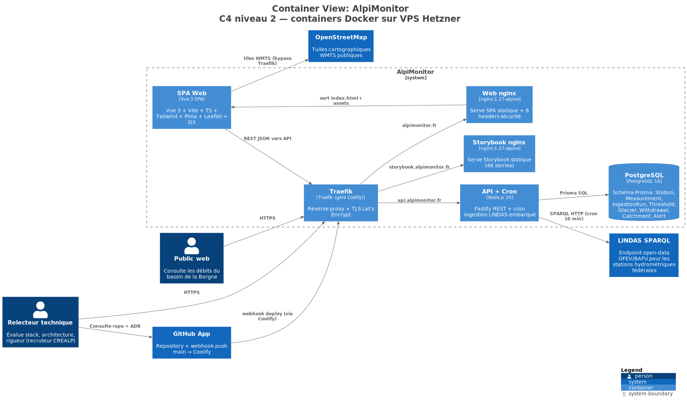
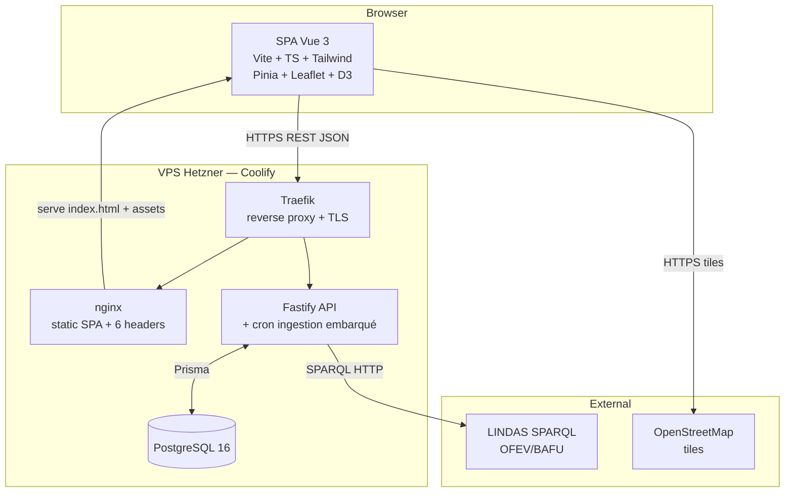

# §5 — Vue des blocs de construction

Décomposition structurelle niveau C4-C2 (containers) avec renvois vers C4-C3 (composants) sur les 3 sous-pages [frontend](frontend.md) / [backend](backend.md) / [persistence](persistence.md).

## 5.1 Niveau container (C4-C2)

Vue C4 niveau 2 (exportée depuis [Structurizr](../assets/structurizr/workspace.dsl)) :

La même topologie en Mermaid inline, orientée flux :

Cinq containers effectifs côté VPS (Traefik + nginx + api + postgres + un 4e nginx pour `storybook.alpimonitor.fr` non représenté). Deux sources externes sans relation entre elles.

| Container | Rôle | Stack | Communication |
|-----------|------|-------|---------------|
| **SPA** (web) | UI publique lecture seule | Vue 3 + Vite + TS + Tailwind + Pinia + Leaflet + D3 | REST JSON → API, tiles HTTPS → OSM |
| **API** | Endpoints REST + cron ingestion | Node 20 + Fastify 5 + Prisma 5 + Zod + Pino + node-cron | SQL → DB, SPARQL HTTP → LINDAS |
| **PostgreSQL** | Persistance stations, mesures, ingestion runs | PostgreSQL 16 (container Docker Coolify) | SQL via Prisma |
| **Traefik** | TLS, routing, Let's Encrypt auto | Traefik géré par Coolify | — |
| **nginx** (SPA static) | Serveur statique + 6 headers sécurité | nginx:1.27-alpine | — |

Le 5e container `storybook-nginx` suit le même pattern que `nginx` SPA, servi sur `storybook.alpimonitor.fr` (cf. [ADR-009](../09-architectural-decisions/adr-009.md)).

## 5.2 Découpage des responsabilités

Les trois sous-pages détaillent chaque container au niveau C4-C3 (composants internes) :

- **[Frontend (Vue 3 + Pinia)](frontend.md)** — couches `atoms/molecules/organisms/templates/pages`, façades `composables/stations/`, `lib/` domain-scoped, règle enforced « aucun consumer prod hors façades ».
- **[Backend (Fastify + Prisma)](backend.md)** — routes, services, plugin ingestion LINDAS avec cron interne, plugin observabilité.
- **[Persistence (PostgreSQL)](persistence.md)** — schéma Prisma commenté, migrations additives, `IngestionRun` comme table de trace.

Les **types et schémas Zod** partagés entre frontend et backend vivent dans `packages/shared/src/` :

- `types/` — `StationDTO`, `MeasurementSeries`, `IngestionLastRun`, etc.
- `schemas/` — schémas Zod consommés par l'API (validation input/output) et ré-exportés côté web pour un typage runtime cohérent.

Cette couche garantit qu'une modification de contrat propage une erreur TypeScript dans les deux apps. Pas de duplication de types, pas de drift silencieux.
