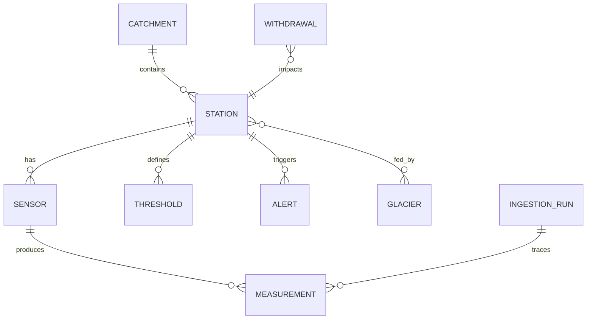

# Persistence (PostgreSQL via Prisma)

Schéma de données + conventions Prisma. Référence autoritative : `apps/api/prisma/schema.prisma`.

## 5.P.1 Schéma (vue d'ensemble)

Tables du schéma :

- **`Catchment`** — bassin versant (aujourd'hui `borgne` uniquement, extensible v2).
- **`Station`** — 7 stations seedées : 4 LIVE (BAFU via LINDAS) + 3 RESEARCH (CREALP Borgne). Champs clés : `id`, `ofevCode` (unique), `name`, `riverName`, `latitude`, `longitude`, `altitudeM`, `flowType` (`NATURAL` | `RESIDUAL` | `DOTATION`), `operatorName`, `dataSource` (`LIVE` | `RESEARCH` | `SEED`), `sourcingStatus` (`CONFIRMED` | `ILLUSTRATIVE`, cf. [ADR-008](../09-architectural-decisions/adr-008.md)), `isActive`.
- **`Sensor`** — un par combinaison `{stationId, parameter}`. Paramètres : `DISCHARGE`, `WATER_LEVEL`, `TEMPERATURE` (non-ingested v1), `TURBIDITY` (non-ingested v1).
- **`Measurement`** — séries temporelles. Contrainte unique `(sensorId, recordedAt)` — socle de l'idempotence de l'upsert. Alimenté exclusivement par le cron LINDAS.
- **`IngestionRun`** — trace chaque tick du cron. Champs : `source`, `status` (`SUCCESS` | `FAILURE` | `PARTIAL`), `startedAt`, `completedAt`, `stationsSeenCount`, `measurementsCreatedCount`, `measurementsSkippedCount`, `errorMessage?`, `httpStatus?`, `payloadBytes?`, `payloadHash?`, `durationMs`. Lu par `/api/v1/status`.
- **`Threshold`** — seuils `VIGILANCE` / `ALERT` par station + paramètre (seedés en dur v1, pas d'admin UI).
- **`Alert`** — ouvertures/fermetures d'alertes (schéma en place, évaluation hors scope v1).
- **`Glacier`**, **`StationGlacier`** — glaciers du bassin (Ferpècle, Mont Miné), jonction station ↔ glacier.
- **`Withdrawal`** — captages Grande Dixence (Ferpècle 1896 m, Arolla 2009 m).
- **`User`**, **`ThresholdAudit`** — schéma présent mais non utilisé v1 (admin JWT hors scope).

## 5.P.2 Conventions

- **Cuids** comme PK (`id: String @id @default(cuid())`). Pas d'UUID, pas d'auto-increment.
- **Timestamps systématiques** — `createdAt: DateTime @default(now())` et `updatedAt: DateTime @updatedAt` sur les entités à cycle de vie.
- **Enums en SCREAMING_SNAKE_CASE** — verbatim DTO front/back, pas de conversion casing. `dataSource: 'LIVE'`, `sourcingStatus: 'CONFIRMED'`, `Parameter: 'DISCHARGE'` cohabitent sans singularité à défendre.
- **Index composites** — sur `Measurement(sensorId, recordedAt DESC)` pour les requêtes de série temporelle. Sur `IngestionRun(startedAt DESC)` pour `/status`.
- **Pas de soft delete** — `isActive: boolean` sur `Station` si besoin de masquer sans supprimer. Pas de `deletedAt` partout.

## 5.P.3 Migrations

- **Strategy additive uniquement en prod** — jamais de `DROP COLUMN`, `DROP TABLE`, `ALTER TYPE` destructif en production. Les évolutions se font par migrations additives (`ADD COLUMN NOT NULL DEFAULT`) puis backfill puis nettoyage différé si nécessaire.
- **Nommage** — `YYYYMMDDHHMMSS_description_snake_case` généré par `prisma migrate dev --name description-kebab-case`. Exemple : `20260422141207_add_station_sourcing_status`.
- **Historique versionné** — toutes les migrations vivent dans `apps/api/prisma/migrations/` et sont committées. Prisma les replay via `prisma migrate deploy` dans `entrypoint.sh` au boot.
- **Pas de `prisma migrate reset` en prod** — destructeur, effacerait toutes les données. Interdit par convention d'ops (cf. [post-mortem 2026-04-21](../07-deployment-view/post-mortems/2026-04-21.md) pour le contexte).

## 5.P.4 Seed idempotent

`apps/api/prisma/seed.ts` — alimenté via `upsert` sur clés naturelles stables :

- `Catchment` upserted sur `id`.
- `Station` upserted sur `ofevCode` (unique).
- `Sensor` upserted sur `(stationId, parameter)`.
- `Threshold` upserted sur `(stationId, parameter)`.
- `Glacier` upserted sur `name`.
- `StationGlacier` upserted sur `(stationId, glacierId)`.
- `Withdrawal` upserted sur `name`.

`pruneStaleStations(currentOfevCodes)` supprime les `Station` dont `ofevCode` n'est pas dans la liste seed actuelle — cascade `Measurement`, `Alert`, `Threshold`, `Sensor`, `StationGlacier`. C'est l'opération qui aurait pu causer l'incident 2026-04-21 si un seed stale avait été lancé contre prod (non prouvé, cf. post-mortem).

Le seed **ne touche jamais** `Measurement`, `Alert`, `IngestionRun` — tables opérationnelles, exclusivement écrites par le cron.

## 5.P.5 Observabilité côté DB

- **`/api/v1/health`** exécute un `SELECT 1` via Prisma. Retour `database: 'ok'` ou `'error'`.
- **`/api/v1/status`** lit le dernier `IngestionRun` (tri `startedAt DESC LIMIT 1`) et calcule `lastSuccessAt` (tri `status = 'SUCCESS' ORDER BY startedAt DESC LIMIT 1`). Compteurs journée via agrégat `COUNT` + `SUM` sur `IngestionRun` depuis minuit UTC.
- **Pas de métrique Prometheus exposée** — reportée post-candidature. Pino JSON stdout suffit pour agréger à la main si besoin.
