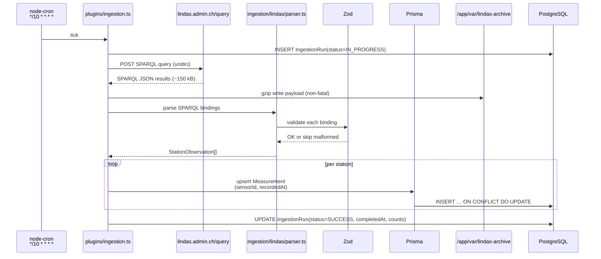
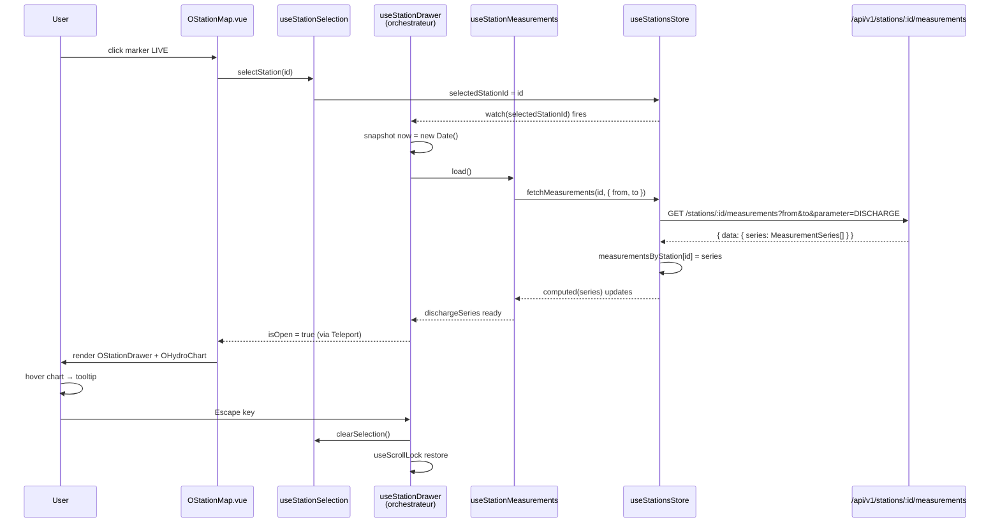
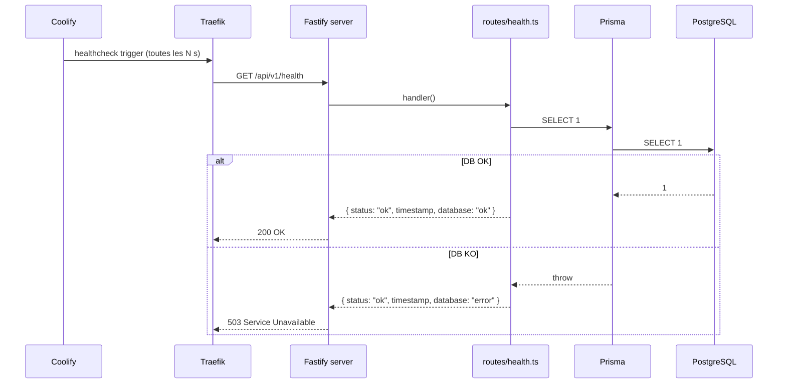

# §6 — Vue d'exécution

Scénarios runtime critiques qui illustrent le comportement des blocs de [§5](../05-building-block-view/index.md) en interaction. Trois scénarios couvrent le cycle complet : ingestion, consultation UI, santé.

## 6.1 Ingestion LINDAS — un tick de cron

Déclenché toutes les 10 minutes par `node-cron` dans le plugin `ingestion.ts`. Idempotent — rejouer le même tick n'insère pas de doublon.

Points clés :

- **Archive non-fatale** — un échec d'archive (`EACCES`, disque plein) logue `warn` et continue. L'ingestion SPARQL n'est jamais bloquée par un problème de stockage local.
- **Upsert idempotent** — clé composite `(sensorId, recordedAt)`. Si LINDAS republie la même observation au tick suivant, `ON CONFLICT DO UPDATE` retourne sans créer de doublon.
- **Trace systématique** — `IngestionRun` capture le cycle entier même en échec (`status=FAILURE`, `errorMessage`, `httpStatus`). `/status` le lit au tick suivant pour piloter le badge UI.

## 6.2 Sélection station — clic marker → drawer → chart 24 h

Scénario UI central. Orchestré par `useStationDrawer` ([§5 frontend](../05-building-block-view/frontend.md#5f3-orchestrateur-usestationdrawer)).

Points clés :

- **`selectedStationId` est la source de vérité** — tout part d'elle. La fermer = `selectedStationId = null`, ce qui cascade sur `isOpen`, `dischargeSeries`, le scroll lock body, etc.
- **Cache par station** — `measurementsByStation[id]` est indexé. Cliquer sur une station déjà ouverte dans les 10 min ne re-fetch pas (sauf `retry()` → `{ force: true }`).
- **Window snapshot** — `now` est snapshotté à la sélection. Tant que le drawer est ouvert, la fenêtre 24 h reste stable — pas de glissement à chaque tick d'horloge.
- **Escape + scroll lock** — primitives `useEscapeClose` et `useScrollLock` (composables/shared/) sont montées via `useStationDrawer`. Pas de listener direct dans le `.vue`.

## 6.3 Health check probe

Scénario d'ops minimal — consommé par Coolify/Traefik pour déterminer si le container API est prêt à recevoir du trafic.

Deux contrats importants :

- **`/health` reste cheap** — un seul `SELECT 1`, aucune lecture de `IngestionRun`. Appelable à la seconde sans charge mesurable.
- **`/status` porte la vérité ingestion** — si un consumer veut savoir "quand a eu lieu la dernière ingestion réussie ?", c'est `/status` qu'il lit, pas `/health`. Séparation intentionnelle pour permettre un `/health` robuste même si la table `IngestionRun` est corrompue.

## 6.4 Scénarios non détaillés ici

Les scénarios admin (JWT login, CRUD thresholds) du PRD initial sont hors scope v1. La séquence complète associée (login JWT + `PUT /stations/:id/thresholds` + audit) reste tracée dans le code legacy `docs/architecture/overview.md` §4.3 (hors du site MkDocs, consultable dans le repo) comme référence v2 si le projet continue post-candidature.
