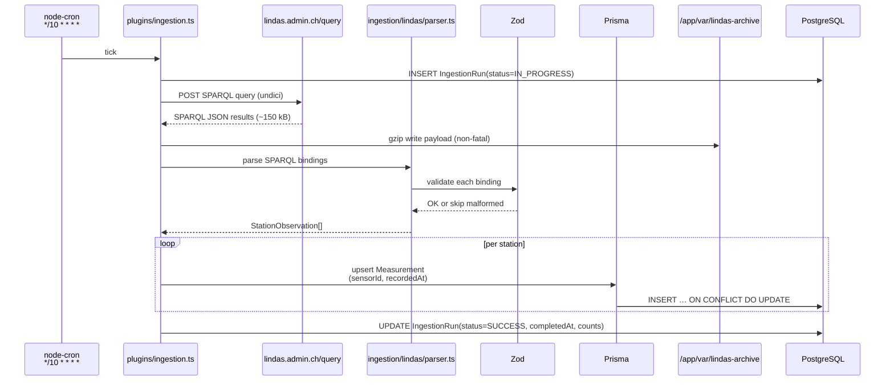
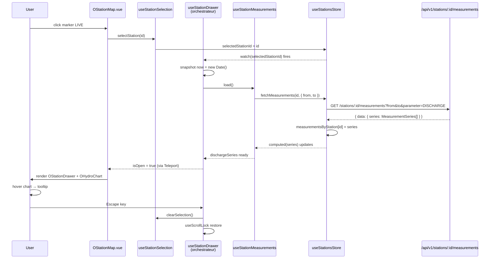
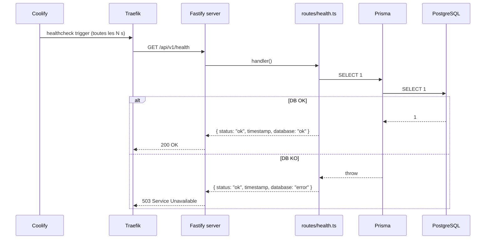

# §6 — Vue d'exécution

Scénarios runtime critiques qui illustrent le comportement des blocs de [§5](../05-building-block-view/index.md) en interaction. Quatre scénarios couvrent le cycle complet : ingestion, consultation UI, santé, et chat sur données structurées (couche IA).

## 6.1 Ingestion LINDAS — un tick de cron

Déclenché toutes les 10 minutes par `node-cron` dans le plugin `ingestion.ts`. Idempotent — rejouer le même tick n'insère pas de doublon.

```mermaid
sequenceDiagram
    participant Cron as node-cron<br/>*/10 * * * *
    participant Plugin as plugins/ingestion.ts
    participant LINDAS as lindas.admin.ch/query
    participant Parser as ingestion/lindas/parser.ts
    participant Zod
    participant Prisma
    participant Archive as /app/var/lindas-archive
    participant DB as PostgreSQL

    Cron->>Plugin: tick
    Plugin->>DB: INSERT IngestionRun(status=IN_PROGRESS)
    Plugin->>LINDAS: POST SPARQL query (undici)
    LINDAS-->>Plugin: SPARQL JSON results (~150 kB)
    Plugin->>Archive: gzip write payload (non-fatal)
    Plugin->>Parser: parse SPARQL bindings
    Parser->>Zod: validate each binding
    Zod-->>Parser: OK or skip malformed
    Parser-->>Plugin: StationObservation[]
    loop per station
        Plugin->>Prisma: upsert Measurement<br/>(sensorId, recordedAt)
        Prisma->>DB: INSERT … ON CONFLICT DO UPDATE
    end
    Plugin->>DB: UPDATE IngestionRun(status=SUCCESS, completedAt, counts)
```

Points clés :

- **Archive non-fatale** — un échec d'archive (`EACCES`, disque plein) logue `warn` et continue. L'ingestion SPARQL n'est jamais bloquée par un problème de stockage local.
- **Upsert idempotent** — clé composite `(sensorId, recordedAt)`. Si LINDAS republie la même observation au tick suivant, `ON CONFLICT DO UPDATE` retourne sans créer de doublon.
- **Trace systématique** — `IngestionRun` capture le cycle entier même en échec (`status=FAILURE`, `errorMessage`, `httpStatus`). `/status` le lit au tick suivant pour piloter le badge UI.

## 6.2 Sélection station — clic marker → drawer → chart 24 h

Scénario UI central. Orchestré par `useStationDrawer` ([§5 frontend](../05-building-block-view/frontend.md#5f3-orchestrateur-usestationdrawer)).

```mermaid
sequenceDiagram
    participant User
    participant Map as OStationMap.vue
    participant Selection as useStationSelection
    participant Drawer as useStationDrawer<br/>(orchestrateur)
    participant Measurements as useStationMeasurements
    participant Store as useStationsStore
    participant API as /api/v1/stations/:id/measurements

    User->>Map: click marker LIVE
    Map->>Selection: selectStation(id)
    Selection->>Store: selectedStationId = id
    Store-->>Drawer: watch(selectedStationId) fires
    Drawer->>Drawer: snapshot now = new Date()
    Drawer->>Measurements: load()
    Measurements->>Store: fetchMeasurements(id, { from, to })
    Store->>API: GET /stations/:id/measurements?from&to&parameter=DISCHARGE
    API-->>Store: { data: { series: MeasurementSeries[] } }
    Store->>Store: measurementsByStation[id] = series
    Store-->>Measurements: computed(series) updates
    Measurements-->>Drawer: dischargeSeries ready
    Drawer-->>Map: isOpen = true (via Teleport)
    Map->>User: render OStationDrawer + OHydroChart
    User->>User: hover chart → tooltip
    User->>Drawer: Escape key
    Drawer->>Selection: clearSelection()
    Drawer->>Drawer: useScrollLock restore
```

Points clés :

- **`selectedStationId` est la source de vérité** — tout part d'elle. La fermer = `selectedStationId = null`, ce qui cascade sur `isOpen`, `dischargeSeries`, le scroll lock body, etc.
- **Cache par station** — `measurementsByStation[id]` est indexé. Cliquer sur une station déjà ouverte dans les 10 min ne re-fetch pas (sauf `retry()` → `{ force: true }`).
- **Window snapshot** — `now` est snapshotté à la sélection. Tant que le drawer est ouvert, la fenêtre 24 h reste stable — pas de glissement à chaque tick d'horloge.
- **Escape + scroll lock** — primitives `useEscapeClose` et `useScrollLock` (composables/shared/) sont montées via `useStationDrawer`. Pas de listener direct dans le `.vue`.

## 6.3 Health check probe

Scénario d'ops minimal — consommé par Coolify/Traefik pour déterminer si le container API est prêt à recevoir du trafic.

```mermaid
sequenceDiagram
    participant Coolify
    participant Traefik
    participant Fastify as Fastify server
    participant Handler as routes/health.ts
    participant Prisma
    participant DB as PostgreSQL

    Coolify->>Traefik: healthcheck trigger (toutes les N s)
    Traefik->>Fastify: GET /api/v1/health
    Fastify->>Handler: handler()
    Handler->>Prisma: SELECT 1
    Prisma->>DB: SELECT 1
    alt DB OK
        DB-->>Prisma: 1
        Handler-->>Fastify: { status: "ok", timestamp, database: "ok" }
        Fastify-->>Traefik: 200 OK
    else DB KO
        Prisma-->>Handler: throw
        Handler-->>Fastify: { status: "ok", timestamp, database: "error" }
        Fastify-->>Traefik: 503 Service Unavailable
    end
```

Deux contrats importants :

- **`/health` reste cheap** — un seul `SELECT 1`, aucune lecture de `IngestionRun`. Appelable à la seconde sans charge mesurable.
- **`/status` porte la vérité ingestion** — si un consumer veut savoir "quand a eu lieu la dernière ingestion réussie ?", c'est `/status` qu'il lit, pas `/health`. Séparation intentionnelle pour permettre un `/health` robuste même si la table `IngestionRun` est corrompue.

## 6.4 Chat sur données structurées — `POST /ask`

Scénario de la couche IA C ([ADR-012](../09-architectural-decisions/adr-012.md)). Une question en langage naturel → function-calling Mistral sur le `QueryPort` → réponse **groundée** sur des faits récupérés en base. Tout le flux est gardé (coût + IP), borné (2 rounds), et grounding-strict (hors périmètre → refus).

```mermaid
sequenceDiagram
    participant User
    participant Panel as OChatPanel<br/>useDataChat
    participant Route as routes/ask.ts
    participant Guard as rate-guard (C4)
    participant Chat as chat-service (C3b)
    participant LLM as Mistral<br/>(ObservingLlmClient, D)
    participant Port as QueryPort<br/>PrismaQueryAdapter (C1)
    participant DB as PostgreSQL

    User->>Panel: question + Envoyer
    Panel->>Route: POST /api/v1/ask { question, language? }
    Route->>Guard: check(ip)
    alt cost cap atteint OU quota IP dépassé
        Guard-->>Route: refus (cost_cap | rate_minute | rate_day)
        Route-->>Panel: 429 RATE_LIMITED (+ Retry-After) — AUCUN appel LLM
    else autorisé (slot consommé)
        Guard-->>Route: ok
        Route->>Route: validation Zod du body (sinon 400)
        loop round 0..2 (borne DURE — D5)
            Chat->>LLM: completeWithTools(system grounding-strict, messages, 4 tools, operation='chat')
            LLM-->>Chat: prose (terminé) OU tool_calls
            opt tool_calls (rounds 0–1 ; round 2 forcé tool_choice='none')
                Chat->>Port: dispatch(name, args) parmi les 4 fonctions whitelistées
                Port->>DB: SELECT (délègue aux services existants)
                DB-->>Port: faits structurés
                Port-->>Chat: résultat (réinjecté en message 'tool')
            end
        end
        Chat-->>Route: { answer, used: ToolUse[] }
        Route-->>Panel: 200 { answer, used, language, generatedAt }
        Panel->>User: réponse + trace discrète des tools appelés
    end
    note over Route,LLM: un LlmError → 503 AI_UNAVAILABLE (gracieux), jamais un 500 brut
```

Points clés :

- **Garde avant dépense** — le rate-guard court-circuite en **429** *avant* tout parsing ou appel LLM. Le plafond coût ($0,50/j sur le `costUsdToday` total A+C) est un **disjoncteur** lu depuis l'observabilité D, pas un quota par requête.
- **Boucle bornée à 2 rounds (D5)** — 3 appels LLM maximum ; le dernier est forcé en prose (`tool_choice: 'none'`). Il n'existe pas de 4ᵉ appel.
- **Grounding STRICT** — le LLM ne narre que des faits récupérés via les 4 fonctions whitelistées (`QueryPort`). Hors périmètre → **« je ne peux pas répondre »**. La trace `used` (tools réellement appelés) remonte au front pour transparence.
- **Function-calling, pas de SQL ni de vectoriel** — le LLM *choisit* parmi 4 fonctions typées ; il n'écrit jamais de requête, et il n'y a ni embeddings ni vector store. Détail des blocs : [§5.B.8](../05-building-block-view/backend.md#5b8-chat-sur-donnees-structurees-adr-012-extension-c).
- **Dégradation gracieuse** — un `LlmError` (Mistral down, clé absente) devient un **503** propre côté API ; `useDataChat` le mappe en raison UI honnête (« IA indisponible »), jamais une 5xx brute affichée.

## 6.5 Scénarios non détaillés ici

Les scénarios admin (JWT login, CRUD thresholds) du PRD initial sont hors scope v1. La séquence complète associée (login JWT + `PUT /stations/:id/thresholds` + audit) reste tracée dans le code legacy `docs/architecture/overview.md` §4.3 (hors du site MkDocs, consultable dans le repo) comme référence v2 si le projet continue post-candidature.
