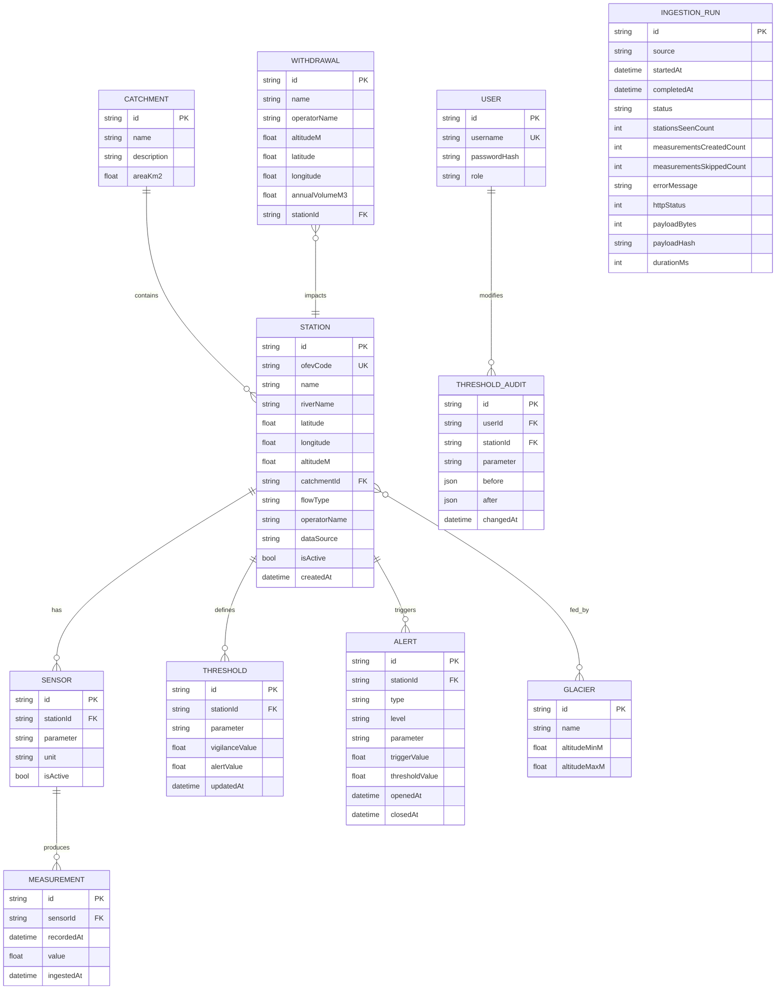

# Data Model — Schéma Prisma commenté

> Ce document explique le **modèle de données** d'AlpiMonitor : entités, relations, contraintes.
> Le schéma Prisma réel vivra dans `apps/api/prisma/schema.prisma` et doit rester cohérent avec ce document.

## 1. Vue d'ensemble



## 2. Entités détaillées

### 2.1 Catchment (bassin versant)

Représente un bassin versant ou sous-bassin géographique.

Exemple en seed : « Bassin de la Borgne » avec superficie ~383 km².

```prisma
model Catchment {
  id          String   @id @default(cuid())
  name        String   @unique
  description String?
  areaKm2     Float?
  stations    Station[]
  createdAt   DateTime @default(now())
}
```

### 2.2 Station (station hydrométrique)

Point physique de mesure, généralement opéré par l'OFEV ou un canton.

Champs critiques :

- **`ofevCode`** : identifiant numérique OFEV/BAFU (ex: `"2011"` pour Sion/Rhône, `"2346"` pour Brig). Unique. Sert de clé de jointure avec le feed SPARQL LINDAS (`schema:identifier`). Pour les stations non fédérales, on utilise un placeholder `TBD-*` (ex. `TBD-BRAMOIS`) réconcilié ultérieurement si un code est publié.
- **`flowType`** : enum `NATURAL | RESIDUAL | DOTATION`. Distingue un débit naturel, résiduel (après captage) ou de dotation (minimum légal). Important pour l'interprétation métier.
- **`dataSource`** : enum `LIVE | RESEARCH | SEED`. Voir [ADR-007](adr/007-lindas-sparql-data-source.md). Drive :
  - le choix des stations par le cron d'ingestion (seules les `LIVE` sont requêtées sur LINDAS)
  - l'affichage d'un badge UI explicite pour les stations `RESEARCH` / `SEED` (pas de fausse donnée temps-réel)
- **`operatorName`** : `OFEV` pour les `LIVE`, `CREALP` / `Grande Dixence SA` pour les `RESEARCH` selon l'opérateur réel.
- **`isActive`** : permet de désactiver une station sans la supprimer (historique préservé).

```prisma
model Station {
  id             String         @id @default(cuid())
  ofevCode       String         @unique
  name           String
  riverName      String
  latitude       Float
  longitude      Float
  altitudeM      Float
  catchmentId    String
  catchment      Catchment      @relation(fields: [catchmentId], references: [id])
  flowType       FlowType       @default(NATURAL)
  operatorName   String         @default("OFEV")
  dataSource     DataSource     @default(LIVE)
  isActive       Boolean        @default(true)
  sensors        Sensor[]
  thresholds     Threshold[]
  alerts         Alert[]
  glaciers       StationGlacier[]
  withdrawals    Withdrawal[]
  auditEntries   ThresholdAudit[]
  createdAt      DateTime       @default(now())
}

enum FlowType {
  NATURAL
  RESIDUAL
  DOTATION
}

enum DataSource {
  LIVE      // ingested from LINDAS (open federal BAFU network)
  RESEARCH  // monitored by CREALP / Grande Dixence, not yet integrated
  SEED      // purely demo data, no real-world station behind it
}
```

### 2.3 Sensor (capteur/paramètre mesuré)

Une station peut mesurer plusieurs paramètres (hauteur, débit, température). Chaque paramètre est modélisé comme un **sensor** logique.

Pourquoi séparer `Sensor` de `Station` ? Parce que :

- Certaines stations ne mesurent pas tous les paramètres (nullable serait confus)
- Un capteur peut avoir son propre cycle de vie (maintenance, remplacement)
- Les mesures sont liées à un capteur, pas à une station abstraite

```prisma
model Sensor {
  id           String         @id @default(cuid())
  stationId    String
  station      Station        @relation(fields: [stationId], references: [id])
  parameter    Parameter
  unit         String         // "m3/s", "cm", "degC"
  isActive     Boolean        @default(true)
  measurements Measurement[]
  createdAt    DateTime       @default(now())

  @@unique([stationId, parameter])
}

enum Parameter {
  DISCHARGE      // débit (m³/s)
  WATER_LEVEL    // hauteur d'eau (cm)
  TEMPERATURE    // température (°C)
  TURBIDITY      // turbidité (NTU)
}
```

### 2.4 Measurement (mesure)

Une valeur scalaire à un instant t, produite par un capteur.

**Contrainte d'unicité cruciale** : `(sensorId, recordedAt)` pour idempotence de l'ingestion.

Index important : `(sensorId, recordedAt DESC)` pour les requêtes de série temporelle.

```prisma
model Measurement {
  id          String   @id @default(cuid())
  sensorId    String
  sensor      Sensor   @relation(fields: [sensorId], references: [id])
  recordedAt  DateTime               // timestamp de la mesure OFEV
  value       Float
  ingestedAt  DateTime @default(now())  // quand on l'a persistée

  @@unique([sensorId, recordedAt])
  @@index([sensorId, recordedAt(sort: Desc)])
}
```

**Volume attendu** : 6 stations × 2-3 paramètres × 144 mesures/jour = ~2500 mesures/jour. 90 jours de rétention ≈ 225 000 lignes. Aucun souci de perf.

### 2.5 Threshold (seuils d'alerte)

Seuils configurables par station et par paramètre. Un seuil de vigilance et un seuil d'alerte.

**Sémantique** : pour la hauteur d'eau, `alert > vigilance` ; pour l'étiage, ce serait l'inverse (alerte = débit trop bas). En v1 on se concentre sur les seuils **hauts** (crue). Pour l'étiage, on traitera en v2.

```prisma
model Threshold {
  id              String    @id @default(cuid())
  stationId       String
  station         Station   @relation(fields: [stationId], references: [id])
  parameter       Parameter
  vigilanceValue  Float
  alertValue      Float
  direction       Direction @default(ABOVE)
  updatedAt       DateTime  @updatedAt

  @@unique([stationId, parameter])
}

enum Direction {
  ABOVE   // seuil dépassé vers le haut (crue)
  BELOW   // seuil franchi vers le bas (étiage)
}
```

### 2.6 Alert (alerte)

Représente un événement de dépassement de seuil ou une anomalie statistique.

Cycle de vie : `openedAt` à la création, `closedAt` quand la condition n'est plus réunie.

```prisma
model Alert {
  id             String      @id @default(cuid())
  stationId      String
  station        Station     @relation(fields: [stationId], references: [id])
  type           AlertType
  level          AlertLevel
  parameter      Parameter
  triggerValue   Float
  thresholdValue Float?
  openedAt       DateTime    @default(now())
  closedAt       DateTime?
  metadata       Json?

  @@index([stationId, openedAt(sort: Desc)])
  @@index([closedAt])
}

enum AlertType {
  THRESHOLD_EXCEEDED   // seuil défini dépassé
  STATISTICAL_ANOMALY  // anomalie statistique (>2σ)
  STATION_OFFLINE      // pas de mesure depuis > 2h
}

enum AlertLevel {
  INFO
  VIGILANCE
  ALERT
}
```

### 2.7 Glacier

Entités de contexte, principalement pour le contenu éditorial "contexte". Reliées aux stations via une table pivot.

```prisma
model Glacier {
  id             String            @id @default(cuid())
  name           String            @unique
  altitudeMinM   Float?
  altitudeMaxM   Float?
  stations       StationGlacier[]
}

model StationGlacier {
  stationId  String
  glacierId  String
  station    Station  @relation(fields: [stationId], references: [id])
  glacier    Glacier  @relation(fields: [glacierId], references: [id])

  @@id([stationId, glacierId])
}
```

Exemples seed : Ferpècle, Mont Miné, Arolla, Tsidjiore, Bertol.

### 2.8 Withdrawal (captage Grande Dixence)

Modélise un point de captage hydroélectrique qui impacte une station donnée.

```prisma
model Withdrawal {
  id              String    @id @default(cuid())
  name            String
  operatorName    String    @default("Grande Dixence SA")
  altitudeM       Float
  latitude        Float
  longitude       Float
  annualVolumeM3  Float?
  stationId       String?
  station         Station?  @relation(fields: [stationId], references: [id])
}
```

Exemples seed : "Station de pompage de Ferpècle" (1896 m), "Station de pompage d'Arolla" (2009 m).

### 2.9 User + ThresholdAudit

Utilisateur admin unique en v1 et audit des modifications de seuils.

```prisma
model User {
  id            String            @id @default(cuid())
  username      String            @unique
  passwordHash  String
  role          Role              @default(ADMIN)
  auditEntries  ThresholdAudit[]
  createdAt     DateTime          @default(now())
}

enum Role {
  ADMIN
}

model ThresholdAudit {
  id          String    @id @default(cuid())
  userId      String
  user        User      @relation(fields: [userId], references: [id])
  stationId   String
  station     Station   @relation(fields: [stationId], references: [id])
  parameter   Parameter
  before      Json
  after       Json
  changedAt   DateTime  @default(now())
}
```

### 2.10 IngestionRun (trace du cron LINDAS)

Une ligne par exécution du cron d'ingestion hydro. Conçue pour diagnostiquer une dérive silencieuse (payload figé, compte de mesures qui s'effondre, endpoint LINDAS qui renvoie des 5xx) sans avoir à relire les logs applicatifs.

Choix de design :

- **Payload pas stocké en DB.** Le JSON SPARQL brut vit sur disque sous `var/lindas-archive/YYYY-MM-DD/*.json.gz` (rotation 30 j). Seul le **hash SHA-256** est persisté → permet de détecter deux réponses identiques (pas de nouvelle mesure côté BAFU) sans gonfler la table.
- **`status` en trois états** — `SUCCESS` (tout parsé + inséré), `PARTIAL` (au moins une ligne rejetée par Zod mais le run s'est terminé), `FAILURE` (erreur réseau/parse/DB, aucun insert). Le cron **n'escalade jamais** une erreur vers le process Fastify (fallback critique démo).
- **`source` enum** prévu extensible (ex. `MCH_SWISSMETNET`, `GLAMOS_MASS_BALANCE` en v2) — même table, discrimination par `source`.

```prisma
model IngestionRun {
  id                        String               @id @default(cuid())
  source                    IngestionSourceKind
  startedAt                 DateTime             @default(now())
  completedAt               DateTime?
  status                    IngestionStatus
  stationsSeenCount         Int                  @default(0)
  measurementsCreatedCount  Int                  @default(0)
  measurementsSkippedCount  Int                  @default(0)
  errorMessage              String?
  httpStatus                Int?
  payloadBytes              Int?
  payloadHash               String?              // SHA-256 hex du body SPARQL brut
  durationMs                Int?

  @@index([source, startedAt(sort: Desc)])
}

enum IngestionStatus {
  SUCCESS
  PARTIAL
  FAILURE
}

enum IngestionSourceKind {
  LINDAS_HYDRO
}
```

**Volume attendu** : 1 run / 10-15 min → ~100 lignes/jour → ~36 k/an. Purge optionnelle au-delà de 90 j en v2.

## 3. Stratégie de seed

Le seed (`prisma/seed.ts`) est **idempotent** (upsert sur clés naturelles + prune des entités hors-liste). Il crée :

1. **1 Catchment** : « Bassin de la Borgne »
2. **7 Stations** :
   - **4 `LIVE`** (réseau fédéral, `operatorName = OFEV`, réconciliées sur LINDAS au premier cron) :
     - `2346` Brig/Rhône — amont
     - `2011` Sion/Rhône — intermédiaire
     - `2630` Sion/Sionne — affluent urbain
     - `2009` Porte du Scex/Rhône — exutoire Léman
   - **3 `RESEARCH`** (réseau CREALP, placeholders `TBD-*`, `operatorName = CREALP`) :
     - `TBD-BRAMOIS` Borgne — confluence Rhône
     - `TBD-HAUDERES` Borgne — intermédiaire Val d'Hérens
     - `TBD-EVOLENE` Borgne — amont proche glaciers
3. **Sensors** : `DISCHARGE` + `WATER_LEVEL` pour chaque station (pas de série seed, elles se remplissent depuis l'ingestion cron pour les `LIVE`, restent vides pour les `RESEARCH` avec un badge UI explicite).
4. **2 Glaciers** seed : Ferpècle, Mont Miné (les autres — Arolla, Tsidjiore, Bertol — pourront être ajoutés en v2 si leur pertinence narrative se confirme).
5. **2 Withdrawals** Grande Dixence : Ferpècle, Arolla.
6. **Thresholds `DISCHARGE`** par station, calibrés par ordre de grandeur du cours d'eau (ex. Porte du Scex 600/1000 m³/s, Sionne 5/15 m³/s) — les seuils `WATER_LEVEL` sont volontairement omis car le `waterLevel` LINDAS est une altitude-référencée et non une hauteur depuis le lit.
7. Pas de `Measurement` en seed — les séries se construisent depuis l'ingestion (voir [data-sources.md](../context/data-sources.md)).
8. **1 User admin** : arrive avec US-3.x (authentification). Pas encore en seed v1.

Le seed gère les renames/retraits de stations via un **prune** qui supprime les entités dépendantes dans l'ordre FK-safe (Measurement → Sensor → Threshold → Alert → ThresholdAudit → StationGlacier, puis Station) + détache `Withdrawal.stationId`. Garantit qu'un seed rejoué sur une DB existante converge vers l'état déclaré.

## 4. Migrations et évolution

- **`init`** (2026-04-20) — crée le schéma complet (10 modèles).
- **`add_data_source_and_ingestion_run`** (2026-04-20) — ajout de `Station.dataSource` (`DataSource` enum, default `LIVE`), nouvelle table `IngestionRun` + enums `IngestionStatus` / `IngestionSourceKind`. Motivé par ADR-007 et par le besoin d'observabilité du cron LINDAS.
- Pour v2 : ajout éventuel de `Forecast`, `WeatherObservation`, `GlacierMassBalance`, ou d'un second `IngestionSourceKind` (MCH SwissMetNet).

## 5. Requêtes typiques (pour dimensionner les index)

1. Liste stations actives + dernière mesure par sensor → join + subquery ou lateral join
2. Série temporelle pour un sensor sur N jours → index `(sensorId, recordedAt desc)`
3. Alertes actives (closedAt IS NULL) → index partiel sur `closedAt`
4. Alertes par station sur période → index `(stationId, openedAt desc)`
5. Dernier `IngestionRun` par source (health endpoint, UI freshness badge) → index `(source, startedAt desc)`

Les index définis ci-dessus couvrent ces cas. À revérifier avec `EXPLAIN` en phase de polish (J10).
