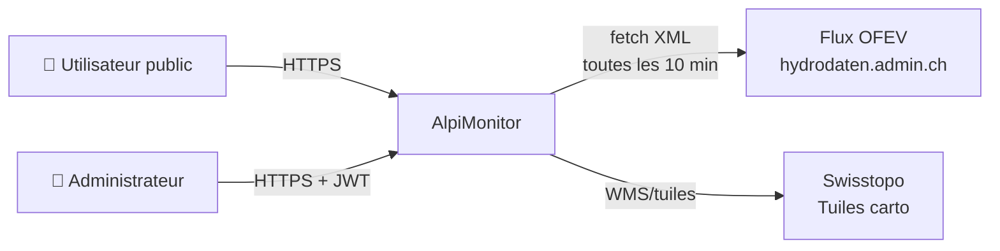
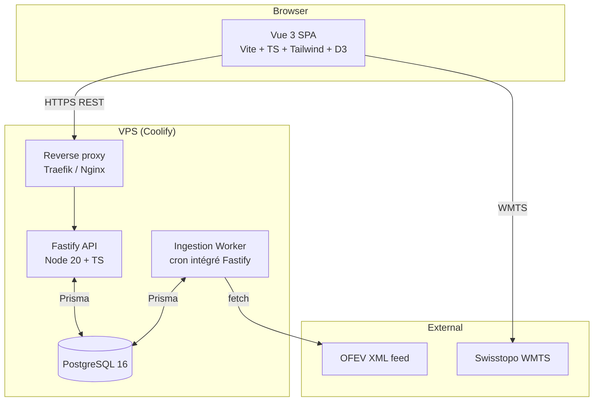
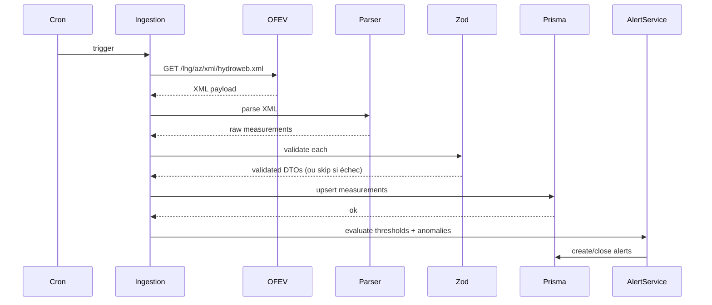
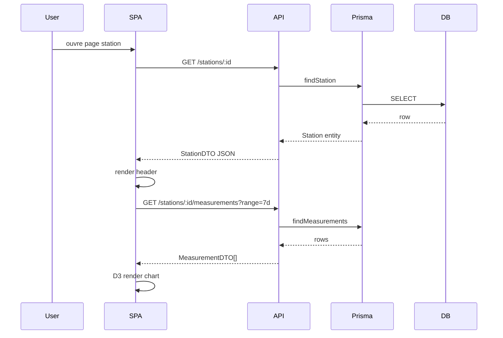
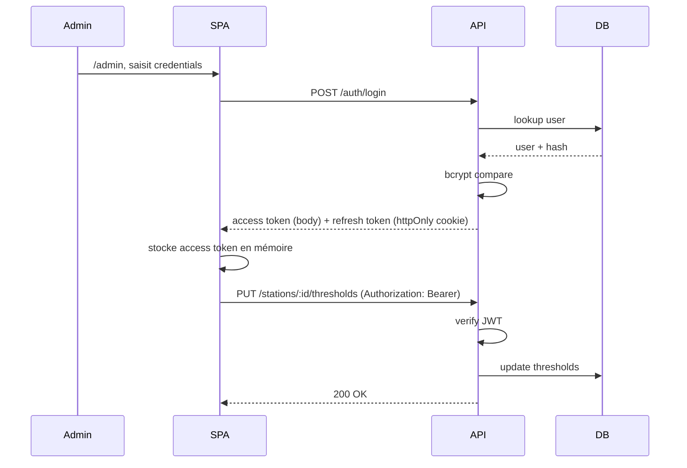

# Architecture Overview

> Vue d'ensemble technique du projet AlpiMonitor. Niveaux C4 : contexte et conteneurs.

## 1. Contexte système (C4 niveau 1)



AlpiMonitor est un système autonome qui consomme deux sources externes (OFEV pour les mesures, swisstopo pour la cartographie) et expose une interface web publique (consultation) et restreinte (administration des seuils).

## 2. Conteneurs (C4 niveau 2)



### Conteneurs en détail

| Conteneur | Rôle | Stack | Comm. |
|---|---|---|---|
| **SPA** | Interface utilisateur | Vue 3 + Vite + TS + Tailwind + D3 + Leaflet | REST JSON vers API |
| **API** | Endpoints REST, auth, business logic | Node 20 + Fastify + TS + Prisma + Zod | REST JSON vers SPA, SQL vers DB |
| **Ingestion** | Fetch périodique OFEV, parsing, persistence | Même runtime que API (plugin/route dédiée + node-cron) | HTTP vers OFEV, SQL vers DB |
| **DB** | Persistence des stations, mesures, alertes, seuils | PostgreSQL 16 | SQL via Prisma |
| **Reverse proxy** | TLS, routing, headers sécurité | Traefik (natif Coolify) | — |

### Décision : monolithe vs. microservices

On part sur un **monolithe Fastify unique** qui héberge à la fois les endpoints REST et le job d'ingestion (via plugin scheduler). Motivations :

- Scope 13 jours : pas de temps pour l'orchestration multi-services
- Ingestion toutes les 10 min = charge faible, pas besoin de l'isoler
- Simplicité de déploiement Coolify (1 container backend au lieu de 2)
- YAGNI : on ne sépare que si un besoin concret apparaît

Voir ADR-003 pour le raisonnement complet.

## 3. Organisation du code

### Monorepo

```
alpimonitor/
├── apps/
│   ├── web/              # SPA Vue 3
│   │   ├── src/
│   │   │   ├── components/   # Atomic Design
│   │   │   │   ├── atoms/
│   │   │   │   ├── molecules/
│   │   │   │   ├── organisms/
│   │   │   │   └── templates/
│   │   │   ├── pages/        # Vues routées
│   │   │   ├── composables/  # Hooks Vue
│   │   │   ├── services/     # Clients API
│   │   │   ├── stores/       # Pinia stores
│   │   │   ├── utils/        # Helpers purs
│   │   │   └── assets/       # CSS global, images
│   │   ├── public/
│   │   └── tests/
│   │
│   └── api/              # API Fastify
│       ├── src/
│       │   ├── domain/       # Entités métier, logique pure
│       │   ├── services/     # Orchestration, use cases
│       │   ├── routes/       # Définition endpoints
│       │   ├── plugins/      # Plugins Fastify (auth, cors, ingestion)
│       │   ├── schemas/      # Zod schemas partagés request/response
│       │   ├── ingestion/    # Parsing XML OFEV, normalisation
│       │   └── utils/
│       ├── prisma/
│       │   ├── schema.prisma
│       │   ├── migrations/
│       │   └── seed/
│       └── tests/
│
├── packages/
│   └── shared/           # Types TS partagés web ↔ api
│       ├── types/
│       └── schemas/      # Zod schemas exposés aux deux apps
│
├── docs/                 # Documentation projet (ce dossier)
├── docker-compose.yml
├── .github/workflows/
└── CLAUDE.md
```

### Découpage des responsabilités

- **domain/** = règles métier pures, sans dépendance framework (testable sans mock)
- **services/** = orchestration (ex: "ingestMeasurement" qui appelle domain, écrit en DB, émet une alerte)
- **routes/** = mapping HTTP → service, validation input, sérialisation output
- **plugins/** = transverse Fastify (auth JWT, rate limit, CORS)
- **ingestion/** = spécifique au flux OFEV, isolé pour être remplaçable

### Packages partagés

`packages/shared` contient les **types TS et schémas Zod** utilisés des deux côtés. Ex : `MeasurementDTO`, `StationDTO`, `AlertDTO`. Le front importe ces types pour ses appels API. Garantie de cohérence sans duplication.

## 4. Flux principaux

### 4.1 Flux d'ingestion (asynchrone, toutes les 10 min)



### 4.2 Flux de consultation (synchrone, à la demande)



### 4.3 Flux d'authentification admin



## 5. Stratégies clés

### Gestion des erreurs

- API : réponses structurées `{ error: { code, message, details? } }`, codes HTTP sémantiques
- SPA : état de query (idle / loading / success / error) via composable dédié
- Ingestion : erreur de fetch = retry 3x exponentiel puis log + skip (pas de crash)
- Logs serveur structurés (pino) avec requestId

### Cache et performance

- Client : pas de stale-while-revalidate en v1, fetch on mount
- Serveur : pas de cache applicatif v1 (Postgres suffit)
- Réponse API : `Cache-Control: public, max-age=60` sur endpoints de consultation
- Assets SPA : hashed filenames, immutable cache

### Observabilité

- Logs pino en JSON stdout, niveaux structurés
- Healthcheck `/health` qui vérifie DB + dernière ingestion < 30 min
- Pas d'APM ni tracing distribué (out of scope v1)

## 6. Environnements

| Env | Cible | Données |
|---|---|---|
| **Local** | `docker-compose up` | Seed complet, ingestion désactivable via env |
| **Preview** | (optionnel) branch deploys Coolify | Seed complet, ingestion désactivée |
| **Production** | Coolify + VPS + domaine | Seed initial + ingestion live OFEV |

### Variables d'environnement principales

```
# API
DATABASE_URL=postgresql://...
JWT_SECRET=...
JWT_REFRESH_SECRET=...
ADMIN_USERNAME=...
ADMIN_PASSWORD_HASH=...
OFEV_FEED_URL=https://www.hydrodaten.admin.ch/lhg/az/xml/hydroweb.xml
OFEV_FETCH_ENABLED=true
OFEV_FETCH_INTERVAL_MINUTES=10
CORS_ORIGINS=https://alpimonitor.example.ch
LOG_LEVEL=info

# Web
VITE_API_BASE_URL=https://api.alpimonitor.example.ch
VITE_TILE_URL=https://wmts.geo.admin.ch/...
```

Voir `.env.example` pour la liste complète une fois l'implémentation démarrée.

## 7. Contraintes et décisions structurantes

Voir les ADR individuels pour le détail :

- [ADR-001 — Stack TypeScript unique](./adr/001-typescript-monostack.md)
- [ADR-002 — Méthodologie ABEM pour le CSS](./adr/002-abem-methodology.md)
- [ADR-003 — Monolithe vs microservices](./adr/003-monolith-over-microservices.md)
- [ADR-004 — Prisma comme ORM](./adr/004-prisma-orm.md)
- [ADR-005 — Leaflet pour la cartographie](./adr/005-leaflet-for-mapping.md)
- [ADR-006 — D3 vanilla vs wrappers Vue](./adr/006-d3-vanilla.md)
