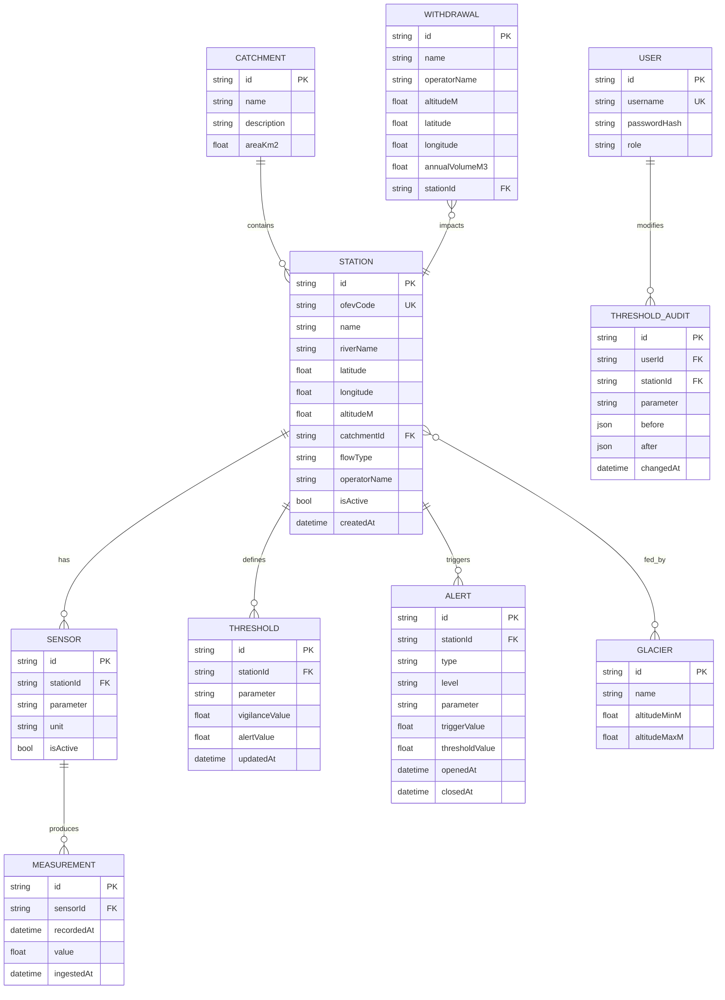

# Data Model — Schéma Prisma commenté

> Ce document explique le **modèle de données** d'AlpiMonitor : entités, relations, contraintes.
> Le schéma Prisma réel vivra dans `apps/api/prisma/schema.prisma` et doit rester cohérent avec ce document.

## 1. Vue d'ensemble



## 2. Entités détaillées

### 2.1 Catchment (bassin versant)

Représente un bassin versant ou sous-bassin géographique.

Exemple en seed : « Bassin de la Borgne » avec superficie ~383 km².

```prisma
model Catchment {
  id          String   @id @default(cuid())
  name        String   @unique
  description String?
  areaKm2     Float?
  stations    Station[]
  createdAt   DateTime @default(now())
}
```

### 2.2 Station (station hydrométrique)

Point physique de mesure, généralement opéré par l'OFEV ou un canton.

Champs critiques :

- **`ofevCode`** : identifiant numérique OFEV (ex: "2011" pour Borgne-Bramois). Unique. Sert de clé de jointure avec le flux XML.
- **`flowType`** : enum `NATURAL | RESIDUAL | DOTATION`. Distingue un débit naturel, résiduel (après captage) ou de dotation (minimum légal). Important pour l'interprétation métier.
- **`isActive`** : permet de désactiver une station sans la supprimer (historique préservé).

```prisma
model Station {
  id             String         @id @default(cuid())
  ofevCode       String         @unique
  name           String
  riverName      String
  latitude       Float
  longitude      Float
  altitudeM      Float
  catchmentId    String
  catchment      Catchment      @relation(fields: [catchmentId], references: [id])
  flowType       FlowType       @default(NATURAL)
  operatorName   String         @default("OFEV")
  isActive       Boolean        @default(true)
  sensors        Sensor[]
  thresholds     Threshold[]
  alerts         Alert[]
  glaciers       StationGlacier[]
  withdrawals    Withdrawal[]
  auditEntries   ThresholdAudit[]
  createdAt      DateTime       @default(now())
}

enum FlowType {
  NATURAL
  RESIDUAL
  DOTATION
}
```

### 2.3 Sensor (capteur/paramètre mesuré)

Une station peut mesurer plusieurs paramètres (hauteur, débit, température). Chaque paramètre est modélisé comme un **sensor** logique.

Pourquoi séparer `Sensor` de `Station` ? Parce que :

- Certaines stations ne mesurent pas tous les paramètres (nullable serait confus)
- Un capteur peut avoir son propre cycle de vie (maintenance, remplacement)
- Les mesures sont liées à un capteur, pas à une station abstraite

```prisma
model Sensor {
  id           String         @id @default(cuid())
  stationId    String
  station      Station        @relation(fields: [stationId], references: [id])
  parameter    Parameter
  unit         String         // "m3/s", "cm", "degC"
  isActive     Boolean        @default(true)
  measurements Measurement[]
  createdAt    DateTime       @default(now())

  @@unique([stationId, parameter])
}

enum Parameter {
  DISCHARGE      // débit (m³/s)
  WATER_LEVEL    // hauteur d'eau (cm)
  TEMPERATURE    // température (°C)
  TURBIDITY      // turbidité (NTU)
}
```

### 2.4 Measurement (mesure)

Une valeur scalaire à un instant t, produite par un capteur.

**Contrainte d'unicité cruciale** : `(sensorId, recordedAt)` pour idempotence de l'ingestion.

Index important : `(sensorId, recordedAt DESC)` pour les requêtes de série temporelle.

```prisma
model Measurement {
  id          String   @id @default(cuid())
  sensorId    String
  sensor      Sensor   @relation(fields: [sensorId], references: [id])
  recordedAt  DateTime               // timestamp de la mesure OFEV
  value       Float
  ingestedAt  DateTime @default(now())  // quand on l'a persistée

  @@unique([sensorId, recordedAt])
  @@index([sensorId, recordedAt(sort: Desc)])
}
```

**Volume attendu** : 6 stations × 2-3 paramètres × 144 mesures/jour = ~2500 mesures/jour. 90 jours de rétention ≈ 225 000 lignes. Aucun souci de perf.

### 2.5 Threshold (seuils d'alerte)

Seuils configurables par station et par paramètre. Un seuil de vigilance et un seuil d'alerte.

**Sémantique** : pour la hauteur d'eau, `alert > vigilance` ; pour l'étiage, ce serait l'inverse (alerte = débit trop bas). En v1 on se concentre sur les seuils **hauts** (crue). Pour l'étiage, on traitera en v2.

```prisma
model Threshold {
  id              String    @id @default(cuid())
  stationId       String
  station         Station   @relation(fields: [stationId], references: [id])
  parameter       Parameter
  vigilanceValue  Float
  alertValue      Float
  direction       Direction @default(ABOVE)
  updatedAt       DateTime  @updatedAt

  @@unique([stationId, parameter])
}

enum Direction {
  ABOVE   // seuil dépassé vers le haut (crue)
  BELOW   // seuil franchi vers le bas (étiage)
}
```

### 2.6 Alert (alerte)

Représente un événement de dépassement de seuil ou une anomalie statistique.

Cycle de vie : `openedAt` à la création, `closedAt` quand la condition n'est plus réunie.

```prisma
model Alert {
  id             String      @id @default(cuid())
  stationId      String
  station        Station     @relation(fields: [stationId], references: [id])
  type           AlertType
  level          AlertLevel
  parameter      Parameter
  triggerValue   Float
  thresholdValue Float?
  openedAt       DateTime    @default(now())
  closedAt       DateTime?
  metadata       Json?

  @@index([stationId, openedAt(sort: Desc)])
  @@index([closedAt])
}

enum AlertType {
  THRESHOLD_EXCEEDED   // seuil défini dépassé
  STATISTICAL_ANOMALY  // anomalie statistique (>2σ)
  STATION_OFFLINE      // pas de mesure depuis > 2h
}

enum AlertLevel {
  INFO
  VIGILANCE
  ALERT
}
```

### 2.7 Glacier

Entités de contexte, principalement pour le contenu éditorial "contexte". Reliées aux stations via une table pivot.

```prisma
model Glacier {
  id             String            @id @default(cuid())
  name           String            @unique
  altitudeMinM   Float?
  altitudeMaxM   Float?
  stations       StationGlacier[]
}

model StationGlacier {
  stationId  String
  glacierId  String
  station    Station  @relation(fields: [stationId], references: [id])
  glacier    Glacier  @relation(fields: [glacierId], references: [id])

  @@id([stationId, glacierId])
}
```

Exemples seed : Ferpècle, Mont Miné, Arolla, Tsidjiore, Bertol.

### 2.8 Withdrawal (captage Grande Dixence)

Modélise un point de captage hydroélectrique qui impacte une station donnée.

```prisma
model Withdrawal {
  id              String    @id @default(cuid())
  name            String
  operatorName    String    @default("Grande Dixence SA")
  altitudeM       Float
  latitude        Float
  longitude       Float
  annualVolumeM3  Float?
  stationId       String?
  station         Station?  @relation(fields: [stationId], references: [id])
}
```

Exemples seed : "Station de pompage de Ferpècle" (1896 m), "Station de pompage d'Arolla" (2009 m).

### 2.9 User + ThresholdAudit

Utilisateur admin unique en v1 et audit des modifications de seuils.

```prisma
model User {
  id            String            @id @default(cuid())
  username      String            @unique
  passwordHash  String
  role          Role              @default(ADMIN)
  auditEntries  ThresholdAudit[]
  createdAt     DateTime          @default(now())
}

enum Role {
  ADMIN
}

model ThresholdAudit {
  id          String    @id @default(cuid())
  userId      String
  user        User      @relation(fields: [userId], references: [id])
  stationId   String
  station     Station   @relation(fields: [stationId], references: [id])
  parameter   Parameter
  before      Json
  after       Json
  changedAt   DateTime  @default(now())
}
```

## 3. Stratégie de seed

Le seed (`prisma/seed/index.ts`) doit créer :

1. **1 Catchment** : "Bassin de la Borgne"
2. **4-6 Stations** : Borgne-Bramois, Borgne-Evolène, Dixence, Rhône-Sion, + éventuellement 1-2 autres selon disponibilité OFEV réelle
3. **Sensors** associés (discharge + water_level au minimum par station)
4. **5 Glaciers** : Ferpècle, Mont Miné, Arolla, Tsidjiore, Bertol
5. **2 Withdrawals** : pompages Ferpècle et Arolla
6. **Thresholds** de démo : valeurs plausibles basées sur moyennes historiques
7. **90 jours de Measurements** générés synthétiquement avec :
   - Tendance saisonnière (pic estival pour régime nival/glaciaire)
   - Variabilité jour/nuit
   - 1-2 événements de crue simulés
   - Quelques anomalies pour tester la détection
8. **1 User admin** : username `admin`, password hashé bcrypt depuis env var

## 4. Migrations et évolution

- Première migration : `init` crée tout le schéma
- Pas de migration prévue en v1 (scope figé)
- Pour v2 : ajout éventuel de `Forecast`, `WeatherObservation`, `GlacierMassBalance`

## 5. Requêtes typiques (pour dimensionner les index)

1. Liste stations actives + dernière mesure par sensor → join + subquery ou lateral join
2. Série temporelle pour un sensor sur N jours → index `(sensorId, recordedAt desc)`
3. Alertes actives (closedAt IS NULL) → index partiel sur `closedAt`
4. Alertes par station sur période → index `(stationId, openedAt desc)`

Les index définis ci-dessus couvrent ces cas. À revérifier avec `EXPLAIN` en phase de polish (J10).
